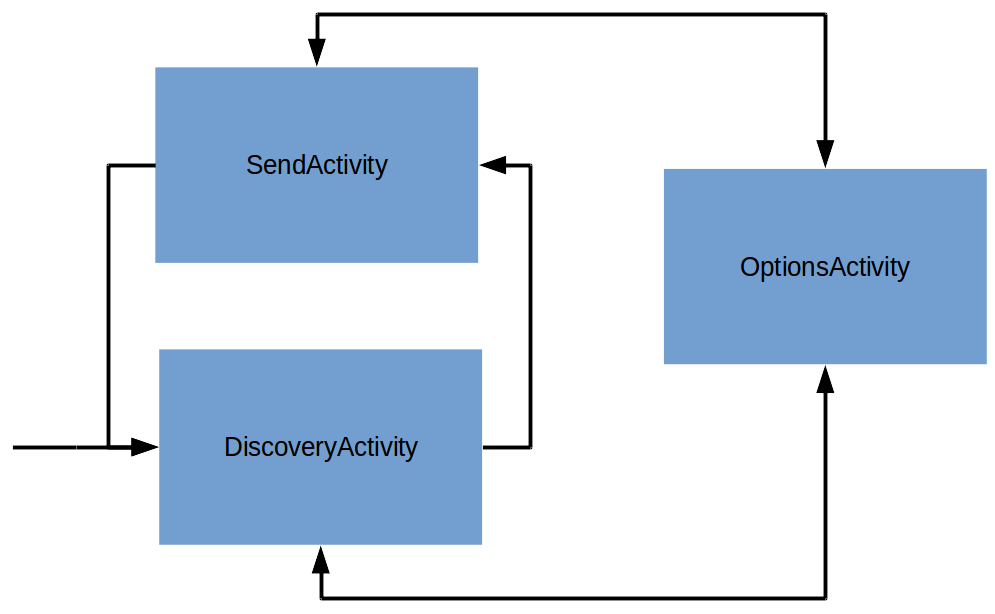
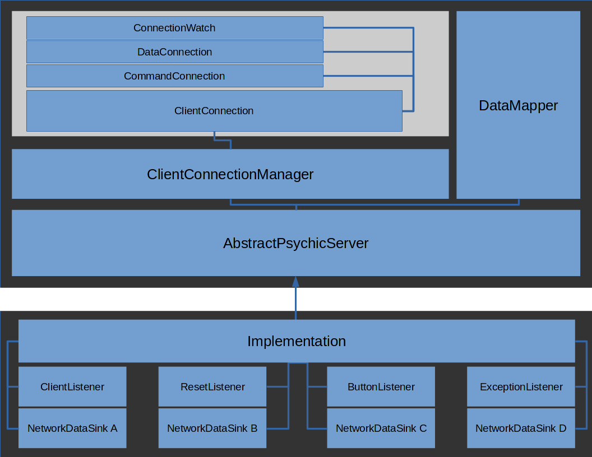
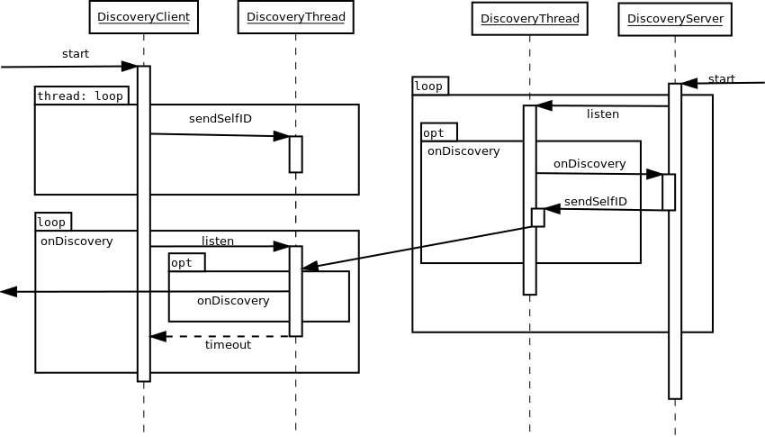
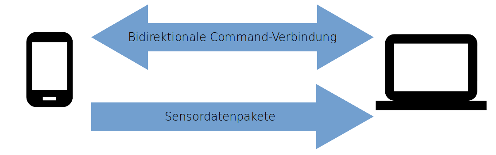

# Architektur
Das Psychic-Framework ist dreigeteilt in die App, den Server und einen gemeinsamen Kern.


## Gemeinsamer Kern
Im gemeinsamen Kern (dem ```common```-Package) sind alle Klassen enthalten, die sowohl vom Server als auch von der App benötigt werden. Das sind unter anderem Klassen wie zum Beispiel ```SensorData```, ```SensorType``` oder ```AbstractCommand```, die in der Kommunikation verwendet werden, aber auch Klassen die vom Client und vom Server separat benutzt werden, z.B. ```ConnectionWatch``` oder ```DiscoveryThread```.


## App
Die App ist dafür zuständig, den Nutzer Server finden zu lassen und mit Servern zu kommunizieren. Sie erlaubt es dem Nutzer außerdem, die Sensitivität für alle Sensoren zu ändern und den Gerätenamen festzulegen.
Wenn der Nutzer sich dafür entschieden hat, mit einem Server in Verbindung zu treten, wird die App anfangen, die Daten der angefragten Sensoren zu übermitteln. Außerdem stellt sie die vom Implementator angefragten Buttons dar, und Benachrichtigt den Server über Knopfdrücke.



Die App startet in der ```DiscoveryActivity```. Hier wird durch den ```DiscoveryClient``` ein Broadcast auf einem DiscoveryPort nach verfügbaren Servern durchgeführt ([Server-Discovery](#server-discovery)). Bei Fund eines Servers wird dieser in der Activity angezeigt. Durch Click des Servers wird in die ```SendActivity``` übergegangen.

Diese Activity instanziiert ```NetworkClient```, durch den eine Initialisierung der [```DataConnection```](#datenverbindung) und [```CommandConnection```](#kontrollverbindung) erfolgt.
Das serverspezifische Buttonlayout wird über die ```CommandConnection``` erhalten und mit Hilfe des ```LayoutParser``` umgesetzt. Die Verbindung zum Server kann durch das Betätigen des Disconnectbuttons beendet werden und man gelangt wieder in die ```DiscoveryActivity```.

Von beiden vorher genannten Activities gelangt man durch einen Knopfdruck in die ```OptionsActivity```. Hier lassen sich Sensitivitätseinstellungen der einzelnen Sensoren vornehmen.
Durch Betätigen des "Zurück"-Buttons gelangt man in die Activity, aus der die OptionsActivity aufgerufen wurde.


## Server
Der Server-Teil des Psychic-Frameworks dient dazu, die Erstellung von neuen Servern möglichst einfach zu machen. Beispiele lassen befinden sich im ```examples```-Package.


# Architektur des Servers

Die Architektur des Servers kann geteilt werden in den ```PsychicServer```-Teil, der die von uns geschriebenen Klassen beinhaltet, und den Teil, den der Implementator erstellen muss.


## Unser Teil

### AbstractPsychicServer
Die Hauptklasse unserer Seite ist der ```AbstractPsychicServer```. Diese Klasse beinhaltet fast alle Funktionen, mit denen der Implementator interagiert, zum Beispiel um Datensenken für Sensoren zu registrieren.
Die Klasse beinhaltet eine ```DataMapper```-Instanz, der von den ```ClientConnection```-Instanzen weitergeleitete Daten nach Client und Sensortyp aufgeschlüsselt an die registrierten Datensenken weiterleitet. Hier werden auch die Kontrollnachrichten, die nicht in der ```ClientConnection``` behandelt werden, behandelt. Das beinhaltet Knopfdrücke aller Clients, Resetevents aller Clients und Verbindungsanfragen, derer dann die Listenerimplementationen des Implementators benachrichtigt werden.


### ClientConnection
Jeder Client wird von einer ```ClientConnection```-Instanz verwaltet. Jede dieser Instanzen wiederum besitzt eine ```DataConnection```- und eine ```CommandConnection```-Instanz. Die ```CommandConnection``` implementiert das Senden und Empfangen von ```AbstractCommand```-Objekten, und die ```DataConnection``` nimmt alle Sensordaten des Clients an. Die ```ClientConnection``` wird über Callbacks von Empfangsereignissen benachrichtigt. Die empfangenen Sensordaten werden mit der korrekten Nutzersensitivität an den ```DataMapper``` weitergeleitet. Mit Ausnahme von wenigen Kontrollnachrichten, die in der ```ClientConnection``` behandelt werden können, wie zum Beispiel die Nachrichten, die die Nutzersensitivität enthalten, werden alle an den ```AbstractPsychicServer``` weitergeleitet. Zusätzlich zu den Nutzersensitivitäten speichert jede ```ClientConnection``` auch den Wertebereich der Sensoren des verbundenen Handys.


### ClientConnectionManager
Der ClientConnectionManager verwaltet alle ```ClientConnection```-Instanzen. Er speichert die vom Implementator vorgegebenen Sensorengeschwindigkeiten, die Knopfkonfiguration und die benötigten Sensoren. Verändert sich der Zustand dieser Anforderungen, benachrichtigt der ```ClientConnectionManager``` alle verbundenen Clients. Zusätzlich können von dieser Klasse neue ```ClientConnection```-Instanzen angefragt werden.


## Implementatorteil

### Callbacks
Der Implementator muss (oder kann, falls er die ```PsychicServer```-Klasse benutzt) die vier Interfaces ```ClientListener```, ```ResetListener```, ```ButtonListener``` und ```ExceptionListener``` implementieren. Er wird dann vom ```AbstractPsychicServer``` bei relevanten Ereignissen benachrichtigt.


### Daten-Pipeline
Die Architektur der Datenpipeline sollte hier evtl noch hin. vllt einfach die beschreibung aus dem devguide abändern wenn das da fertig ist?


# Server-Discovery

Grundlage der Serverfindung auf PC und Handy ist der sogenannte  ```DiscoveryThread```, in dem sich Funktionen befinden, die von Server und Client benötigen. Wichtig sind für die Funktionsweise insbesondere ```sendSelfID```, ```listen``` und der ```onDiscovery```-Callback.

```sendSelfID``` sendet die für weitere Kommunikation notwendigen Informationen in Form eines sich selbst beschreibenden ```NetworkDevice```. Der Client verwendet diese Funktion, um Server via Broadcast zu finden: Empfängt der Server ein solches Paket, wird ```onDiscovery``` aufgerufen, und der ```DiscoveryServer``` schickt an den Sender des Paketes seine eigene Identifikation via ```sendSelfID```. Dann ist der Server dem ```DiscoveryClient``` bekannt, und der ```onDiscovery```-Callback wird aufgerufen. Die App zeigt dem Nutzer den Server dann an, so dass dieser dem Client eine Verbindungsanfrage stellen kann. Erlaubt die Implementation dem Client die Verbindung, ist die Verbindung aufgebaut.

```listen``` ist auf Client und Server dafür zuständig, per ```sendSelfID``` gesendete Pakete zu empfangen, und den ```onDiscovery```-Callback auszulösen.
Der Port, auf dem der Server die Broadcasts erwartet, muss in der App eingegeben werden, falls nicht der Standardport ```8888``` verwendet wird.


# Kommunikation
Alle Daten und Commands werden als serialisierte Java-Objekte übertragen. Das Framework nutzt für alle Ports zufällige freie Ports, ausgenommen den für die Serverfindung genutzten, da dieser der App im Voraus bekannt sein muss.



## Kontrollverbindung
Die Kontrollverbindung läuft über TCP; für jede neue Kontrollnachricht wird eine neue Verbindung aufgebaut. Jede der Kontrollnachrichten ist ein ```AbstractCommand```. Diese Klasse enthält ein Enum, dass den Typ des Kontrollpakets beschreibt, so dass es einfach in die entsprechende Klasse gecastet werden kann. Diese Klassen können Instanzen aller serialisierbaren Klassen enthalten, so dass alle benötigten Daten einfach mitgeliefert werden können.

Die Kontrollverbindung ist bidirektional, der Client kann also auch ```AbstractCommand```-Objekte an den Server schicken. Das wird unter anderem für die Knöpfe verwendet, aber auch um den Server über den Wertebereich von Sensoren zu informieren.


## Datenverbindung
Nachdem der Nutzer sich mit einem Server verbunden hat, übermittelt dieser die aktuell benötigte Konfiguration. Nachdem die App diese umgesetzt hat, sind die benötigten Sensoren aktiviert. Alle generierten Daten werden ohne weitere Verarbeitung serialisiert und an den Datenport des Servers übermittelt, um den Rechenaufwand in der App möglichst gering zu halten. Die Übermittlung läuft über UDP, so dass kein expliziter Verbindungsaufbau für jedes Paket nötig ist.
