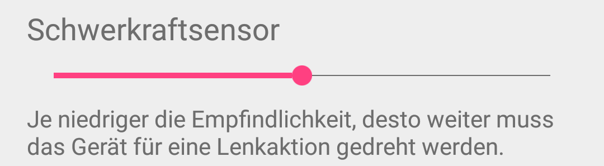
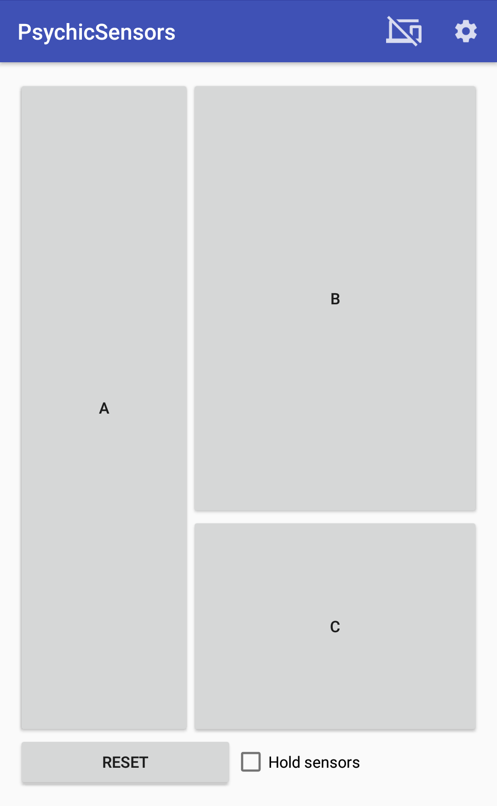

# TODO
* Sonstiges:
    - JavaDoc einbauen
    - PLAY STORE
        + link zu release
    - javadoc ist teilweise horribly out of date. wir müssen zumindest bei dem kram den die potenziell angucken korrigieren!
    - github release mit: framework code als zip, framework als jar, beispielserver gui als jar
* DeveloperGuide.md
    - how to use framework mit intellij
* Einleitung.md
* Architektur.md
    - klassendiagramm anhängen
* bilder fixen 

## TODO: bruder
* Formalia: betreuer, professor, einfach mal template angucken

* deutsch/englisch -> deutsch

* man braucht client server -> nicht bluetoothmaus?
* usability
* wiederverwertbarkeit-> keine nativen implementation
* wiederverwertbarkeit statt framework
* wartbarkeit
* aus den requirements alles rausziehen was eigentlich use case ist, die näher beschreiben
    - (maus, braucht zwei achsen, knöpfe)
    - use cases-> ausführen was das können muss
    - robotersteuerung use cases ausführen!
* use case -> requirements
* verbindungsqualität vor steuerungen?
* ergebnisvorstellung
    - gleiche reihenfolge
    - framework in analyse
* generell: bei den first level headings beschreiben was jetzt kommt, damit der leser sich nicht selbst überlegen muss was als nächstes abgeht, sondern vorbereitet ist
    - projektverlauf: was kommt jetzt überhaupt
    - devguide jetzt kommt der devguiide, hier gibts die javadoc
    - vorstellung ergebnisse: high level übersicht: was ist entstanden
    - kurze einleitung, das ziel, wie folgt strukturiert mit sinn

# Developer Guide für das Psychic-Framework
Das Psychic-Framework bezeichnet eine Kombination aus einer App und einem Serverframework mit einem gemeinsamen Kern. Dieses Framework dient der schnellen und einfachen Entwicklung von PC-Applikationen, die Sensordaten von Android-Geräten verwenden möchten.


## JavaDoc
Eine komplette JavaDoc ist verfügbar unter TODO


## Grundlegende Verwendung:
Es gibt zwei Möglichkeiten einen Server zu implementieren: Entweder wird ```AbstractPsychicServer``` erweitert, oder ein ```PsychicServer``` wird instanziiert.

Wenn ```AbstractPsychicServer``` erweitert wurde, müssen folgende Interfaces implementiert werden:

* [ButtonListener](#verwendung-von-buttons)
* [ClientListener](#verwaltung-von-clients)
* [ResetListener](#resetevents)
* [ExceptionListener](#exceptionhandling)

Wenn ein ```PsychicServer``` instanziiert wurde, kann gewählt werden welche Interfaces interessant sind; für jedes kann ein Listener mit einer der folgenden Funktionen registriert werden:

* ```setButtonListener(ButtonListener)```
* ```setClientListener(ClientListener)```
* ```setResetListener(ResetListener)```
* ```setExceptionListener(ExceptionListener)```


Nachdem ein Server mit ```start()``` gestartet wurde, können sich Clients verbinden. Wird ein Server mit ```close()``` geschlossen werden alle Clients getrennt. Die Instanz kann nicht wieder verwendet werden, ein weiterer Aufruf von ```start()``` wird eine Exception erzeugen.

> Hinweis: Falls nicht anders angegeben, befinden sich alle nachfolgend genannten Funktionen im ```AbstractPsychicServer```, sind also auch im ```PsychicServer``` verfügbar.

Sind die Interfaces implementiert, fehlt noch der eigentlich wichtigste Schritt: Es müssen Daten von den Clients angefragt werden.


### Wichtige Hilfsklassen
Weil viele der folgenden Erklärungen diese Klassen benutzen, werden sie hier kurz erwähnt:

* ```SensorType```-Enum: Alle unterstützten Sensoren. [Dokumentation](#sensoren)
* ```NetworkDevice```: Identifiziert einen Client. [Dokumentation](#networkdevice)
  - ```getName()```: Name des Clients
  - ```getAddress()```: IP-Adresse des Clients
* ```NetworkDataSink```: Dieses Interface ermöglicht implementierenden Klassen, Sensordaten anzunehmen. [Dokumentation](#networkdatasink)


### Daten bestellen
Das Kernthema des Psychic-Frameworks sind Sensordaten. Diese werden zuerst an eine ```NetworkDataSink``` geleitet, und werden mit der ```registerDataSink(NetworkDataSink, SensorType)```-Funktion angefordert. Die übergebene ```NetworkDataSink``` wird dann die unveränderten Daten von dem durch den ```SensorType```-Parameter angegebenen Sensor erhalten. [Die Verwendung von ```NetworkDataSink``` sowie die ```onData```-Funktion werden hier genauer beschrieben.](#networkdatasink)

Sollen nur Daten eines einzelnen Clients an eine Datensenke gelangen, steht ```registerDataSink(NetworkDataSink, NetworkDevice, SensorData)``` zur Verfügung. Wird diese Funktion genutzt, werden nur Daten vom spezifizierten ```NetworkDevice``` an der übergebenen ```NetworkDataSink``` ankommen.

Sensordaten lassen sich mit dem Psychic-Framework am besten mithilfe der [Daten-Pipeline](#daten-pipeline) bearbeiten, bis sie der Anwendung genügen.


#### Beispiel einer Serverinstanziierung
```Java
public class ExampleServer implements NetworkDataSink {
    public ExampleServer() throws IOException {
        Server server = new Server();
        server.start();
        server.registerDataSink(this, SensorType.Gyroscope);
    }

    public void onData(NetworkDevice origin, SensorData sensorData, float userSensitivity){
      System.out.println("received" + Arrays.toString(sensorData.data));
    }

    public void close(){
    }
}
```


### Daten abbestellen
Wenn eine ```NetworkDataSink``` nicht mehr benötigt wird, zum Beispiel weil der entsprechende Client getrennt wurde, kann sie mit ```unregisterDataSink(NetworkDataSink)``` von allen Sensoren abgemeldet werden, und mit  ```unregisterDataSink(NetworkDataSink, SensorType)``` von bestimmten Sensoren abgemeldet werden. Danach erhält die ```NetworkDataSink``` keine Daten mehr vom Server.

## Daten-Pipeline


Das Psychic-Framework ist darauf ausgerichtet, dass Sensordaten mithilfe einer Pipeline benutzt werden die auf dem Handy mit dem Sensor beginnt und auf dem Server mit der Anwendung endet. Bis dahin können die Sensordaten flexibel mithilfe von ```AbstractFilter```, ```NetworkDataSource``` und ```NetworkDataSink``` gefiltert und weitergeleitet werden.


### Format der Sensordaten: SensorData
Alle Daten werden in ```SensorData```-Objekten transportiert. In ```SensorData```-Objekten sind folgende Informationen enthalten:

* ```data```: Ein ```float```-Array, in dem die [Sensorwerte](https://developer.android.com/reference/android/hardware/SensorEvent.html#values) gespeichert sind.
* ```sensorType```: Der ```SensorType``` des [Sensors](#sensoren), der diese Daten produziert hat
* ```timestamp```: Der [Timestamp](https://developer.android.com/reference/android/hardware/SensorEvent.html#timestamp) der Sensordaten


### NetworkDataSink
Das ```NetworkDataSink```-Interface muss implementiert werden, wenn eine Klasse Daten aus der Pipeline erhalten soll. Es beinhaltet zwei Funktionen:

* ```close()```: Die Instanz wird nicht mehr benötigt, und sollte alle Ressourcen schließen.
* ```onData(NetworkDevice, SensorData, float)```: wird immer dann aufgerufen, wenn die Daten die Pipeline bis zu dieser Senke durchlaufen haben.
  * Der erste Parameter, ```origin```, spezifiziert das ```NetworkDevice```, also den Client, der diese Daten gesendet hat.
  * Der zweite Parameter, ```sensorData```, enthält die [Sensordaten](#format-der-sensordaten-sensordata).
  * Der dritte Parameter, ```userSensitivity```, spezifiziert die Sensitivität die in der App für den Sensor eingestellt wurde. Der Wert liegt standardmäßig bei ```50```, und es gilt ```0 <= userSensitivity <= 100```.


### NetworkDataSource
Das ```NetworkDataSource```-Interface muss von Klassen implementiert werden, die Daten in Pipeline-Element einspeisen möchte, zum Beispiel nachdem sie aus dem Netzwerk entnommen wurden. Es beinhaltet zwei Funktionen:

* ```close()```: Die Instanz wird nicht mehr benötigt, und sollte alle Ressourcen schließen.
* ```setDataSink(NetworkDataSink)```: Alle Daten, die von der ```NetworkDataSource``` erzeugt wurden, müssen an die hier erhaltene ```NetworkDataSink``` geleitet werden.


### Sensoren
Folgende Sensoren werden unterstützt:

* Accelerometer
* AmbientTemperature
* GameRotationVector
* Gravity
* Gyroscope
* GyroscopeUncalibrated
* Light
* LinearAcceleration
* MagneticField
* MagneticFieldUncalibrated
* Orientation
* Pressure
* Proximity
* RelativeHumidity
* RotationVector

Diese Liste ist synonym mit dem ```SensorType```-Enum. Enthalten sind alle Sensoren, deren [reporting mode](https://source.android.com/devices/sensors/report-modes.html) ```continuous``` oder ```on-change``` ist und die bis spätestens API-Level 19 unterstützt wurden.


#### Maximalwerte
Die Maximalwerte der Sensoren können mithilfe von ```getSensorMaximumRange(SensorType)``` für alle verbundenen Geräte oder mit ```getSensorMaximumRange(SensorType, NetworkDevice)``` für ein spezielles Gerät abgefragt werden.

<a href="https://developer.android.com/reference/android/hardware/Sensor.html#getMaximumRange()">Siehe auch die Android-Dokumentation hierzu.</a>


#### Update-Frequenz
Die Update-Frequenz der Android-Sensoren kann mithilfe von ```setSensorSpeed()``` gesetzt werden, unterstützt sind die folgenden Werte:

* [SENSOR_DELAY_FASTEST](https://developer.android.com/reference/android/hardware/SensorManager.html#SENSOR_DELAY_FASTEST)
* [SENSOR_DELAY_GAME](https://developer.android.com/reference/android/hardware/SensorManager.html#SENSOR_DELAY_GAME)
* [SENSOR_DELAY_NORMAL](https://developer.android.com/reference/android/hardware/SensorManager.html#SENSOR_DELAY_NORMAL)
* [SENSOR_DELAY_UI](https://developer.android.com/reference/android/hardware/SensorManager.html#SENSOR_DELAY_UI)


#### Beschreibungen anzeigen
Es ist mit ```sendSensorDescription(SensorType, String)``` möglich, erweiterte Beschriftungen für die Nutzung der Sensoren anzeigen zu lassen, um dem Nutzer die Zuordnung von Sensor zu Funktion zu vereinfachen.



### Filter
Filter sind Pipelineelemente, die erhaltene Daten bearbeiten und dann weiterleiten, zum Beispiel einen Tiefpassfilter. Um neue Filter zu erstellen sollte ```AbstractFilter``` erweitert werden; alle folgenden Beschreibungen beziehen sich auf diese Klasse.


#### onData
`onData(NetworkDevice, SensorData, float` ist die interessanteste Funktion eines Filters. Sie wird immer dann aufgerufen wenn der Filter die Daten verarbeiten muss, nachdem das vorherige Element der Pipeline seine Verarbeitung abgeschlossen hat.

Nach der Verarbeitung der Daten müssen diese mit `forwardData(NetworkDevice, SensorData, float` an das nächste Element der Pipeline weitergeleitet werden. Wenn das nächste Element nicht festgelegt wurde, wird `forwardData` `false` zurückgeben ohne die Daten weiterleiten zu können bis `setDataSink(NetworkDataSink` aufgerufen wurde. Alternativ setzt auch der Konstruktor `AbstractFilter(NetworkDataSink` das nächste Element.


#### Beispiel
```Java
class UserSensitivityMultiplicator extends AbstractFilter {
    MyFilter(NetworkDataSink sink){
        super(sink);
    }

    public void onData(NetworkDevice origin, SensorData sensorData, float userSensitivity) {
        // apply the sensitivity set by the user
        for(int i = 0; i < sensorData.data.length; i++)
            sensorData.data[i] *= userSensitivity;

        // forward modified data to next element in pipeline
        forwardData(origin, sensorData, 1f);
    }
}
```


#### Vorhandene Filter

* ```AbsoluteFilter```: Ersetzt alle Werte durch den Absolutwert
* ```AveragingFilter```: Ersetzt die Werte durch den Durchschnitt der letzten n Werte
* ```DifferenceThresholdFilter```: Ersetzt die Werte durch ```0```, wenn die Differenz zwischen aufeinanderfolgenden Werten nicht groß genug ist
* ```IntegratingFilter```: Ersetzt die Werte durch die Summe der vorherigen Werte
* ```MinimumAmplitudeChangeFilter```: Ersetzt den Wert durch den vorherigen Wert wenn die Differenz zwischen aufeinanderfolgenden Werten nicht groß genug ist
* ```ScalingFilter```: Skaliert die Werte von ```-sourceRange``` bis ```+sourceRange``` zu ```-targetRange``` bis ```-targetRange```
* ```TemporaryIntegratingFilter```: Bildet die Summe der letzten ```n``` Werte.
* ```ThresholdingFilter```: Ersetzt die Werte durch ```0``` wenn die Amplitude nicht groß genug ist
* ```UserSensitivityMultiplicator```: Multipliziert die Daten mit dem ```userSensitivity```-Faktor und ersetzt diesen durch ```1f```.


### Daten-Splitter
Splitter sind Klassen, die ```NetworkDataSink``` implementieren, und die erhaltenen Daten an verschiedene ```NetworkDataSink```-Interfaces weiterleiten.

Vorhandene Implementierungen:

* ```ClientSensorSplitter```: Nur Daten, für deren Client und Sensor eine ```NetworkDataSink``` registriert wurde, werden an diese weitergeleitet
* ```ClientSplitter```: Nur Daten, für deren Client eine ```NetworkDataSink``` registriert wurde, werden an diese weitergeleitet
* ```SensorSplitter```: Nur Daten, für deren Sensor eine ```NetworkDataSink``` registriert wurde, werden an diese weitergeleitet.
* ```PipelineDuplication```: Alle Daten werden dupliziert und an alle registrierten ```NetworkDataSink```s weitergeleitet.
* ```Switch```: Die Daten werden an eine von zwei ```NetworkDataSink```-Interfaces weitergeleitet


### Pipeline-Builder
Mit einer ```FilterPipelineBuilder```-Instanz lassen sich Filterpipelines einfach erstellen.
```Java
// this is how we define a filter pipeline:
FilterPipelineBuilder builder = new FilterPipelineBuilder();
builder.append(new ScalingFilter(20, 5));
builder.append(new UserSensitivityMultiplicator());
builder.append(new AveragingFilter(3));
builder.append(new DifferenceThresholdFilter(0.1f));

// register our pipeline to receive gyroscope data
registerDataSink(builder.build(new MyNetworkDataSink()), SensorType.Gyroscope);
```


#### Elemente hinzufügen
Es gibt drei Methoden um ein neues Element in die Pipeline einzubauen: ```prepend(AbstractFilter)```, um ein Element an den Anfang zu setzen; ```append(AbstractFilter)```, um ein Element ans Ende der Pipeline zu setzen, und ```append(AbstractFilter, int)``` um ein Filterelement in eine beliebige Position der Pipeline zu setzen.


#### Elemente entfernen
Pipelineelemente können mit ```remove(int)``` oder ```remove(AbstractFilter)``` wieder entfernt werden.


#### Pipeline abschließen
Die Pipeline kann mit ```build()``` abgeschlossen werden; dann ist der letzte ```AbstractFilter``` der ans Ende platziert wurde das letze Element in der Pipeline, und die Funktion gibt den Anfang der Pipeline zurück. Mithilfe von ```build(NetworkDataSink)``` kann das letzte Element auch eine ```NetworkDataSink``` sein, nützlich zum Beispiel wenn das letzte Pipelineelement die Daten nicht weiterleiten muss.


### Temporärer Stopp des Datenflusses
Es ist dem Nutzer möglich, mithilfe der "Hold Sensors"-Checkbox das Senden von SensorDaten zu unterbinden.


## Verwaltung von Clients
Um die verschiedenen Client-Events zu handeln, muss ein ```ClientListener``` gesetzt werden, der die Events empfängt. Die Server-Klasse hat dafür den ```setClientListener(ClientListener)```-Befehl.

Beispiel-Implementationen der Funktionen aus dem ```ClientListener```-Interface:
```Java
boolean acceptClient(NetworkDevice newClient){
    return true; // accept any client
}
void onClientDisconnected(NetworkDevice disconnectedClient){
    System.out.println("Oh no! Client " + disconnectedClient.getName() + " has disconnected!")
}
void onClientTimeout(NetworkDevice timeoutClient){
    System.out.println("Oh no! Client " + disconnectedClient.getName() + " had a timeout!")
}
void onClientAccepted(NetworkDevice connectedClient){
    System.out.println("A new client, " + disconnectedClient.getName() + " has connected!")
}
```


### NetworkDevice
Clients werden als ```NetworkDevice``` angegeben. Mit ```getInetAddress()``` kann die aktuelle IP-Adresse als ```InetAddress``` abgefragt werden und unter ```getName()``` ist der Name des ```NetworkDevice``` verfügbar. Im ```NetworkDevice``` ist auch die Portkonfiguration jedes Clients gespeichert.

Wenn ```NetworkDevice.equals(NetworkDevice)``` ```true``` zurückgibt, dann handelt es sich um denselben Client.


### Callbacks

#### acceptClient
`acceptClient(NetworkDevice)` wird immer dann aufgerufen, wenn ein neuer Client, nämlich das übergebene ```NetworkDevice```, versucht sich mit dem Server zu verbinden. Wenn ```acceptClient(NetworkDevice)``` ```true``` zurückgibt, wird der Client angenommen; gibt es ```false``` zurück, wird der Client abgelehnt.


#### onClientDisconnected
`onClientDisconnected(NetworkDevice)` wird aufgerufen, wenn der übergebene Client die Verbindung beendet hat oder nicht mehr erreichbar ist. Der Client ist zum Zeitpunkt des Aufrufs nicht mehr über den Server verfügbar.


#### onClientTimeout
`onClientTimeout(NetworkDevice)` wird aufgerufen, wenn der übergebene Client eine Zeit lang nicht mehr reagiert. Der Client ist zum Zeitpunkt des Aufrufs nicht mehr über den Server verfügbar.


#### onClientAccepted
`onClientAccepted(NetworkDevice) wird aufgerufen wenn die Kommunikation zwischen Server und dem übergebenen neuen Client funktioniert. Diese Funktion wird nur dann aufgerufen, wenn ```acceptClient(NetworkDevice)``` ```true``` für das entsprechende ```NetworkDevice``` zurückgegeben hat.


### Clientanzahl begrenzen
Die maximale Anzahl von Clients ist beschränkt auf ```Integer.INT_MAX```. Ein nutzerdefiniertes Maximum kann mithilfe von ```setClientMaximum(int)``` gesetzt, mit ```getClientMaximum()``` abgefragt und mit ```removeClientMaximum()``` entfernt werden.

## Verwendung von Buttons
```Java
// aus dem ButtonListener Interface
void onButtonClick(ButtonClick click, NetworkDevice origin) {
    if(click.getId() == MY_BUTTON_ID)
        System.out.println("Button MY_BUTTON is currently held: " + click.isPressed());
}
```

Um über Knopfdrücke informiert zu werden, muss ein ```ButtonListener``` registriert werden. Der ```Server``` hat dafür die ```setButtonListener(ButtonListener)```-Funktion.  
Unterklassen des ```AbstractPsychicServer``` müssen das Interface ohnehin implementieren.

Innerhalb der ```onButtonClick(ButtonClick, NetworkDevice)``` kann der Button mithilfe von ```click.getId()``` identifiziert werden, und ```click.isPressed()``` ist ```true``` wenn der Button gedrückt und ```false``` wenn der Button losgelassen wurde.

Buttons werden immer auf allen verbundenen Clients angezeigt.


### Buttons zur Runtime anfordern
Buttons können mit ```addButton(String, int)``` hinzugefügt werden. Der ```String``` ist der Text, den der Button anzeigt, der ```int``` ist die ID, die beim Drücken des Buttons an den Server gesendet wird. Zum Entfernen einzelner Buttons kann ```removeButtons(int)``` verwendet werden.
Ein Aufruf von ```setButtonLayout(String)``` oder ```clearButtons()``` wird alle mit ```addButton``` hinzugefügten Knöpfe entfernen.


### Layouts laden
Eine Alternative ist die Verwendung von ```setButtonLayout(String)```. Hierbei kann eine eigene Android-XML-Layout-Datei als ```String``` übergeben werden.  


#### Einschränkungen für die Layout-Dateien
Es werden nur ```LinearLayout```- und ```Button```-Objekte unterstützt. Ein Beispiel für einen unterstützten XML-String ist das folgende Snippet:

```xml
<?xml version="1.0" encoding="utf-8"?>
<LinearLayout
    xmlns:android="http://schemas.android.com/apk/res/android"
    android:orientation="horizontal">

    <Button
        android:text="A"
        android:id="0"
        android:layout_weight="3"/>

    <LinearLayout
        android:orientation="vertical"
        android:layout_weight="5">

        <Button
            android:text="B"
            android:id="1"
            android:layout_weight="2" />

        <Button
            android:text="C"
            android:id="2"
            android:layout_weight="1" />
    </LinearLayout>
</LinearLayout>
```

Layout-String, wie er in der App angezeigt wird:
<p align="center"></p>

`Button`Elemente unterstützen ausschließlich die folgenden Attribute:

* ```android:text=""``` enthält den vom Button dargestellten Text
* ```android:id=""``` ist die ID, die an den Server übertragen wird, und dort mithilfe von ```ButtonClick.getId()``` abgefragt werden kann
* ```android:layout_weight=""``` wird direkt für den Button gesetzt. Genaue Informationen sind in der [Android-Dokumentation](https://developer.android.com/guide/topics/ui/layout/linear.html#Weight) zu finden.

`LinearLayout`Elemente unterstützen ausschließlich die folgenden Attribute:

* ```android:layout_weight=""``` wird direkt für das Layout gesetzt. Genaue Informationen sind in der [Android-Dokumentation](https://developer.android.com/guide/topics/ui/layout/linear.html#Weight) zu finden.
* ```android:orientation=""``` wird direkt für das Layout gesetzt. Genaue Informationen sind in der [Android-Dokumentation](https://developer.android.com/reference/android/widget/LinearLayout.html#attr_android:orientation) zu finden.

Bei Verwendung von ```setButtonLayout(String)``` werden alle durch ```addButton(String, int)``` hinzugefügten Buttons entfernt und bei
Verwendung von ```addButton(String, int)``` wird das durch ```setButtonLayout``` erstellte Layout entfernt.

Um alle Buttons zu entfernen kann ```clearButtons()``` aufgerufen werden.

## Exceptionhandling
Um alle Exceptions, die in verschiedenen Threads auftreten, aufzufangen, muss ein ```ExceptionListener``` registriert werden. ```onException(Object, Exception, String)``` wird dann aufgerufen, falls eine Exception auftritt, die nicht intern behandelt werden kann.

Beispiel-Implementation:
```Java
    public void onException(Object origin, Exception exception, String info) {
      // print complete info before the stack trace
      System.out.println("Exception in " + origin.getClass() + "; Info: " + info)
      System.out.flush();

      // print the stack trace
      exception.printStackTrace();
    }
```
Der ```origin```-Parameter gibt das Ursprungsobjekt (oder ein übergeordnetes, falls das Ursprungsobjekt dem Nutzer nicht bekannt ist) an, der ```exception```-Parameter gibt die Exception on, und der ```info```-Parameter enthält weitere Informationen zu der Exception und ihrem Grund.


## Resetevents
ResetEvents werden durch den, von anderen Buttons separaten, Reset-Button hervorgerufen. Im ```PsychicServer``` wird das Event an den ```ResetListener``` geleitet, der mit ```setResetListener(ResetListener)``` registriert wurde. Im ```AbstractPsychicServer``` wird die Implementation erzwungen.
```Java
public void onResetPosition(NetworkDevice origin) {
    // pseudo-code!
    mouse.centerOnCurrentScreen();
}
```
Wenn ein Client den "Reset"-Button auf seinem Handy benutzt, wird die ```onResetPosition(NetworkDevice)``` aufgerufen. Dann sollte der derzeitige Status des Handys zurückgesetzt werden. Bei der Beispielimplementation ```MouseServer``` wird der Mauszeiger in die Mitte des Bildschirms gesetzt.


### Reset-Button deaktivieren
Es wird empfohlen den Reset-Button zu implementieren. Er gewährleistet, dass der Nutzer mit einem einfachen, nie wechselndem Button jederzeit in einen Zustand zurückkehren kann, in dem die Anwendung bedienbar ist. Solche Zustände können zum Beispiel durch nicht korrigierten Gyroskop-Drift entstehen. Es ist jedoch möglich, den Reset-Knopf zu deaktivieren, indem die ```hideResetButton(boolean)```-Funktion des Servers aufgerufen wird. Ist der Parameter ```true```, wird der Button versteckt; ist er ```false```, wird der Button angezeigt.


## Notifications anzeigen
Das Framework erlaubt es, Notifications mit beliebigem Titel und Text anzeigen zu lassen.
```Java
displayNotification(int id, String title, String text, NetworkDevice target)
displayNotification(int id, String title, String text)
```
Die ID aller Notifications darf sich mit keiner anderen überschneiden, die vom derzeitigen Server verwendet wird.

Mit dem letzten Parameter lässt sich das ```NetworkDevice``` festlegen, auf dem die Notification angezeigt wird. Wird der Parameter ausgelassen, wird die Notification auf allen Geräten angezeigt.


## Netzwerkverbindung

### Server-Discovery
Das Psychic-Framework nutzt UDP-Broadcasts der Clients bzw. der App, auf die der Server mit seiner Adresse antwortet. Der Port, auf dem der Server die Broadcasts erwartet, muss in der App eingegeben werden, falls nicht der Standardport ```8888``` verwendet wird. Alle Daten und Commands werden als serialisierte Java-Objekte übertragen.


### Datenverbindung
Der Server wartet für jeden Client auf einem eigenen Port auf Daten, die via UDP gesendet werden. Dieser Port wird vom Server gewählt und in der Discovery-Phase dem Client mitgeteilt; es ist ein zufälliger freier Port.


### Kontrollverbindung
Der Server und die App warten jeweils auf zufällig gewählten freien Port; diese werden in der Discovery-Phase ausgetauscht. Die Kontrollverbindung läuft über TCP; für jede neue Kontrollnachricht (```AbstractCommand```) wird eine neue Verbindung aufgebaut.


# Lizenz
Copyright (c) 2017 by the contributors. All rights reserved.

# Eigenständigkeitserklärung
Die Verfasser erklären, dass die vorliegende Arbeit von ihnen selbstständig, ohne fremde Hilfe und ohne die Benutzung anderer als der angegebenen Hilfsmittel angefertigt wurde.

\listoffigures