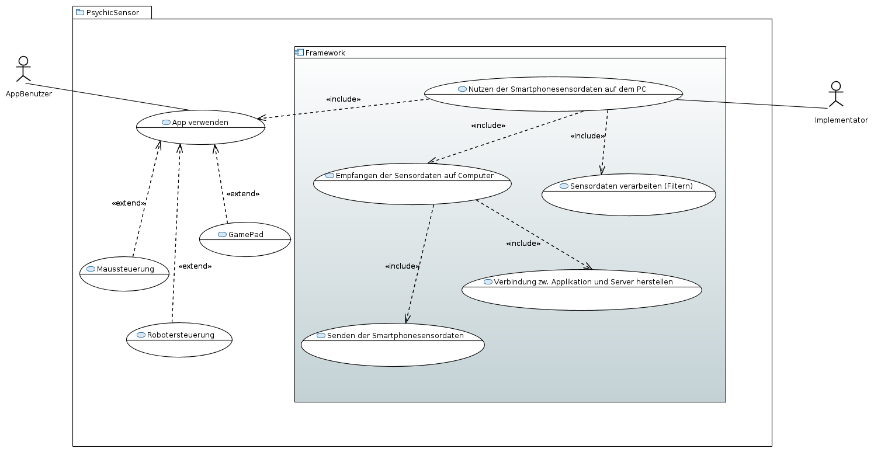
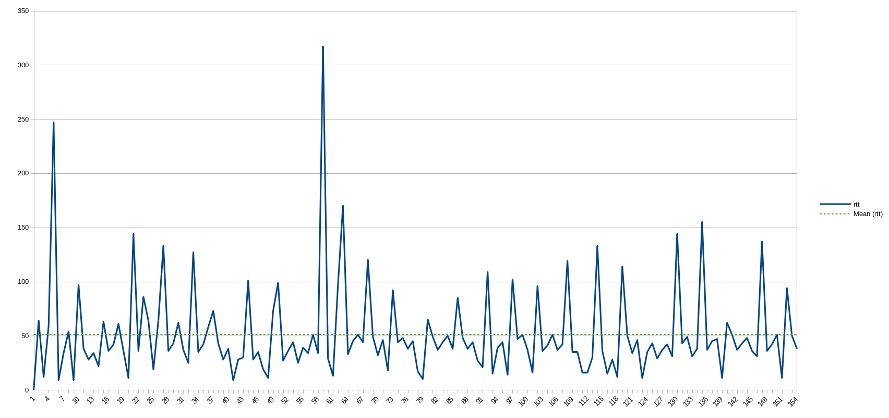
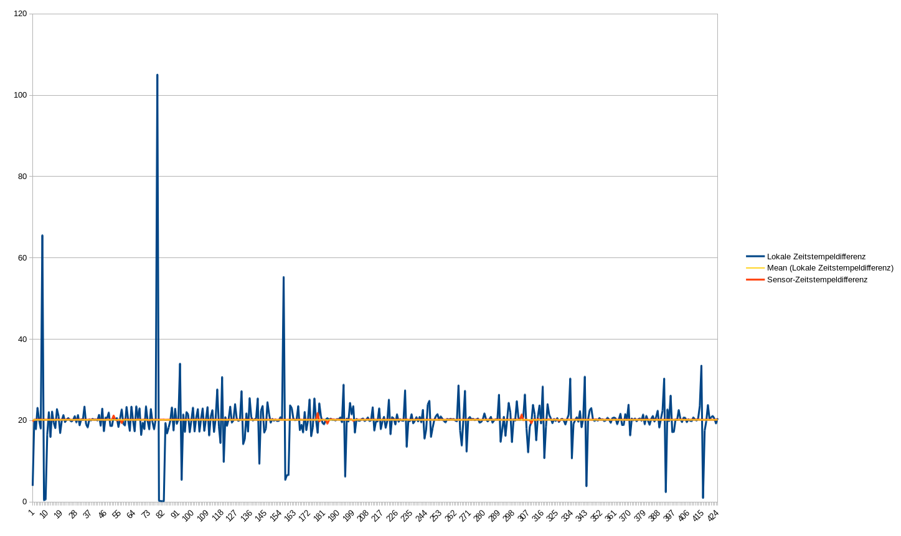
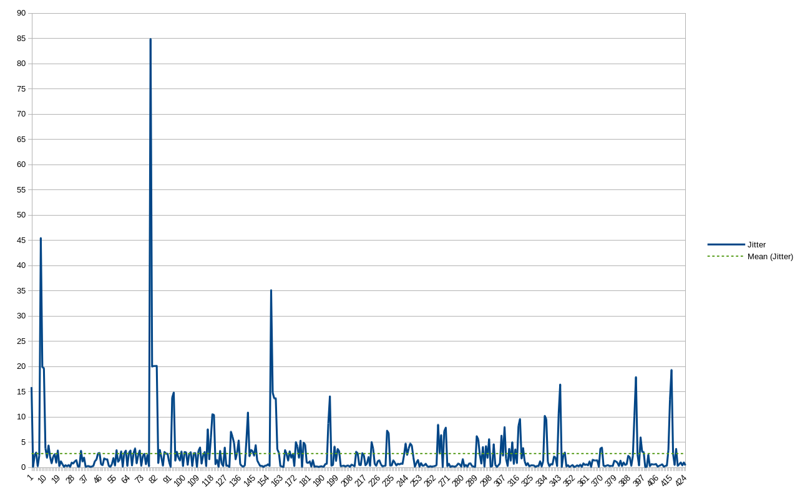

# Ziel
Das Ziel des Projekts war die Erstellung eines Frameworks zur Nutzung von Sensordaten von Androidgeräten auf javafähigen PCs und die Demonstration der Funktionalität dieses Frameworks anhand von drei Beispielanwendungen, nämlich einer Maussteuerung, einer Spielsteuerung und die Bedienung eines Murmellabyrinthes mithilfe eines Roboters.
Mit dem von uns erstellten Framework soll Drittpersonen die Umsetzung von Projekten mit Sensordaten erheblich erleichtert werden.

# Usecase-Analyse

Der AppBenutzer verwendet die App und einen vom Implementierer vorgefertigten Server, um Sensordaten auf eine bestimmte Art zu verwenden.

Der Implementierer nutzt das Framework, um einen Server mit gewünschter Funktionalität umzusetzen,
der dann von AppBenutzern verwendet werden kann.
Hierzu muss das Senden und Empfangen der Sensordaten über eine Verbindung zwischen App und Server, sowie das Verarbeiten dieser Daten berücksichtig werden.

Zur Demonstration dienen eine Maussteuerung, eine Robotersteuerung und ein GamePad zur Spielsteuerung.

# Requirements
Die zur Demonstration dienenden Anwendungen stellen schwer zu definierende Anforderungen an die Latenz und Frequenz der Sensordaten. Wir haben versucht, uns beim Festlegen der Grenzwerte auf bekannte Geräte zu beziehen, die keine Probleme bei der Bedienbarkeit haben.

## Verbindungsqualität

### Frequenz
Um eine Mindestanforderung für die Frequenz der Übertragung festzulegen, haben wir uns an Spielen für Konsolen orientiert, da diese vermutlich ähnliche Anforderungen an Reaktionsgeschwindigkeit stellen wie unsere Beispielimplementationen. Spiele scheinen auf der Xbox One und auf der PS4, beides aktuelle Konsolen, mit mindestens 30 Bildern pro Sekunde zu laufen, siehe zum Beispiel [diese Publikation von Ubisoft](http://blog.ubi.com/watch-dogs-next-gen-game-resolution-dynamism/)[^2]. Deshalb haben wir die Mindestfrequenz die zu unterstützen ist auf 30 Sensordaten pro Sekunde festgelegt.

[^2]: http://blog.ubi.com/watch-dogs-next-gen-game-resolution-dynamism/

### Latenz
Eine akzeptable Grenze für die Latenz festzulegen war schwierig, da Latenzen im Millisekundenbereich nur schwerlich per Hand festzulegen sind. Wir haben daher versucht, uns über die Latenzen professionell hergestellter kabelloser Eingabegeräte zu informieren. Leider ist auch das schwierig, da Hersteller dazu meist keine Informationen veröffentlichen. Wir haben jedoch diesen Artikel von [www.eurogamer.net](http://www.eurogamer.net/articles/digitalfoundry-lag-factor-article?page=2)[^1] gefunden, die sich mit Input-Lag von Konsolen beschäftigt, und bei unterschiedlichen Spielen Unterschiede über 50ms gefunden. Da beide Spiele bedienbar sind, sollte eine Latenz unter diesem Wert keine Probleme verursachen.

[^1]: http://www.eurogamer.net/articles/digitalfoundry-lag-factor-article?page=2

### Jitter
Ein dritter Parameter für die Verbindungsqualität ist der Jitter, das heißt wie sehr sich die Periodizität der ankommenden Sensordaten von der Periodizität der gesendeten Sensordaten unterscheidet. Je geringer der Jitter ist, desto besser ist die Verbindung. Unsere einzige Anforderung an diesen Aspekt der Verbindung war, dass sich kein Jitter bemerkbar macht.

## Maussteuerung
Zusätzlich zu den Anforderungen an die Netzwerkparameter, die flüssige und direkte Steuerung garantieren sollen, muss die Maus auch Knöpfe zur Verfügung stellen, um eine normale Maus zu emulieren.

## Spielsteuerung
Für die Spielsteuerung haben wir einen SNES-Controller emuliert, mit dem wir das Spiel „Super Mario Kart“ spielen können. Wir haben uns für dieses Spiel entschieden, weil für die meisten Spiele sehr viele Knöpfe benötigt werden, die auf einem Touchscreen ohne haptisches Feedback schwer zu bedienen sind während man auf das Spiel schaut.
Um die Anforderungen an die Spielbarkeit festzulegen, haben wir die Zeiten einiger Läufe mit nativen Controllern auf der ersten Karte des Spiels, "Mario Circuit 1", gemessen. Dadurch hatten wir einen Vergleichswert von 1:20, die wir mit unserem Controller mindestens erreichen wollten, bei der dieser einem nativen Controller ähnlich ist.

Außerdem sollte die Anordnung der Buttons in etwa dem nativen Controller entsprechen, weshalb ein flexibles Layouting vom Server aus möglich sein muss.

Um die Itemmechanik von "Super Mario Kart" zu unterstützen, wollten wir lineare Bewegungen in einer separaten Achse auswerten, was die gleichzeitige Nutzung mehrerer Sensoren erforderte.

Außerdem besitzt das Spiel einen Mehrspielermodus, den wir ebenfalls unterstützen wollten, weshalb wir mehrere Clients zur gleichen Zeit annehmen können mussten.

## Robotersteuerung
Die Robotersteuerung stellt keine Anforderungen, die nicht bereits durch die Maussteuerung und der Spielsteuerung gestellt wurden, da die Anforderungen an Latenz und Frequenz nicht höher sind, und Buttons auch schon von der Maus- und Spielsteuerung benötigt werden.

## Framework
Da wir ein entwicklerfreundliches Framework erstellen wollten, mussten wir darauf achten dass unser Projekt nicht nur für unsere Beispiele nutzbar ist.
Es sollte nicht notwendig sein, die App zu verändern, um andere Applikationen zu entwickeln. Wichtig war auch, alle möglichen Anforderungen an die Nachbearbeitung der Daten auf dem Server unterstützen zu können.

Außerdem wollten wir die Anforderungen an den PC für den Server und das Handy für die App möglichst gering halten.

## Bedienbarkeit
Die App sollte möglichst benutzerfreundlich erstellt sein. Das bedeutete für uns, möglichst wenig Konfiguration vom Nutzer zu fordern.

# Vorstellung unserer Ergebnisse

## Framework
Letztlich ist es sehr einfach geworden, einen neuen Server zu implementieren.
Mit unserer Unterstützung aller Sensoren, die kontinuierlich Daten schicken und bis API-Level 19 zu Android hinzugefügt wurden, können unterschiedlichste Anwendungen entwickelt werden.
Mit unserer Unterstützung für vom Implementierer festgelegte Buttonlayouts werden auch hier die möglichen Anwendungen möglichst wenig eingeschränkt. Mit unserer Wahl von Java als Implementationssprache laufen Server auf Windows, Linux und Apple-Geräten, die JDK 8 oder höher installiert haben. Um die Verbindung zu einem Handy aufzubauen, müssen sich Server und Client im gleichen WLAN-Netzwerk mit Zwischenclientkommunikation befinden, ein Zustand, der in den meisten Heimnetzwerken gegeben ist. Alle Android-Geräte mit Unterstützung für API-Level 19, also alle Geräte mit mindestens Android 4.4 können die PsychicSensors-App installieren, werden also als Client unterstützt.

## Bedienbarkeit der App
Das User Interface der App ist recht minimalistisch gehalten. Mit einem Knopfdruck werden Server gesucht, mit einem weiteren wird die Verbindung zu einem der gefundenen Server aufgebaut.
Es ist dem Nutzer möglich, eine Empfindlichkeit für die Sensoren festzulegen, die der Server dann je nach Anwendung interpretieren kann.
Falls der Standard-Discovery-Port auf dem PC auf dem der Server läuft blockiert ist, kann dieser in der App geändert werden.
Insgesamt erfüllt die App unsere Anforderungen an den Client sehr gut.

## Latenz

Die y-Achse ist in Millisekunden angegeben, die x-Achse gibt die Nummer der Messung seit ihrem Beginn an. Da sich die Timestamps des Handys und des Servers nie exakt synchronisieren lassen, haben wir die Round-Trip-Time gemessen. Wie zu sehen ist, liegt die durchschnittliche Round-Trip-Time bei 50ms; die Latenz zwischen Generierung der Sensordaten wird dementsprechend ungefähr bei 25 Millisekunden liegen. Wir sehen unsere Anforderung an die Latenz damit erfüllt.
\newpage

## Frequenz

Die y-Achse ist in Nanosekunden angegeben, die x-Achse gibt die Nummer der Messung seit ihrem Beginn an. Da sich die Timestamps des Handys und des Servers nie exakt synchronisieren lassen, lässt sich hier nur die Differenz zwischen den Ankunftszeiten auf dem PC, und den Sensor-Event-Timestamps auf dem Handy berechnen. Wie zu sehen ist, ist der Durchschnitt der Abstände zwischen dem Ankommen von Sensordaten ungefähr 20ms, was in einer Frequenz von 50Hz resultiert. Da 50Hz unsere Anforderung von 30Hz deutlich überschreitet, sehen wir auch dieses Requirement als erfüllt an.
\newpage

## Jitter

Die y-Achse ist in Millisekunden angegeben, die x-Achse gibt die Nummer der Messung seit ihrem Beginn an. Wie zu sehen ist, bleibt die Differenz zwischen den Periodizitäten zumeist unter 10ms. In der Praxis waren diese Differenzen nie zu spüren. Da die Zeitstempel der Sensordaten übertragen werden, ist es auch möglich verspätete Pakete zu ignorieren.

## Anforderungen der drei Steuerungen
Unsere Anforderungen an die Netzwerkverbindungsqualität haben die Mindestanforderungen der drei Beispielimplementationen erreicht oder übertroffen, da die Steuerungen keine Probleme mit schlechten Reaktionszeiten zeigen.

# Lessons learned
Es ist deutlich effektiver sich gemeinsam zu festen Zeiten zu treffen, um zusammen zu arbeiten als allein. Dadurch haben wir direktes Feedback zu neuen Ideen und deren Umsetzungen von den anderen Teammitgliedern bekommen. Pairprogramming erlaubt Diskussionen und konstruktive Lösungen von neuen Problemen durch andere zu erhalten.
Uns fiel es schwer Grenzwerte für messbare Requirements zu erstellen, die das Projekt beschreiben.
Ein frühzeitiges Festlegen des deployment formats verhindert die Benutzung von Softwarearchitekturen, die eine spätere Bereitstellung der Software erschweren.
