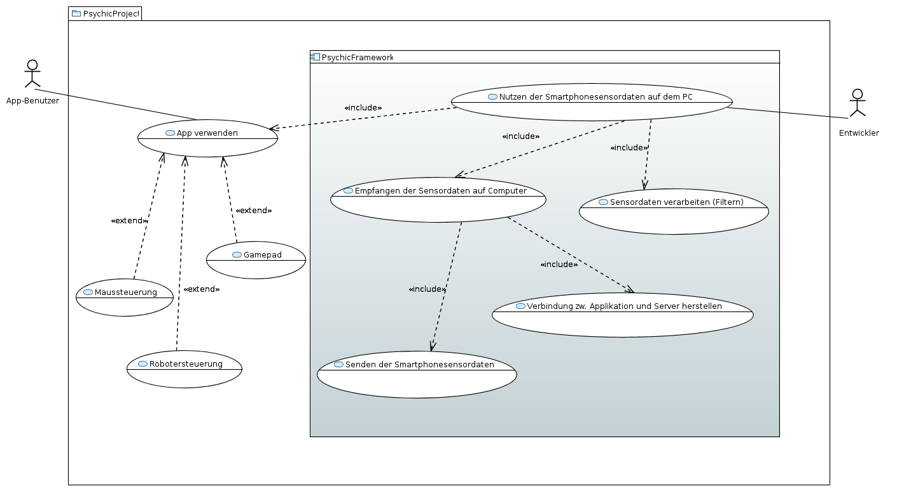

% Abschlussbericht Softwareprojekt: PsychicFramework
% Ulrich Bätjer; Markus Hempel; André Henniger; Arne Herdick
\newpage

# Ziel
Das Ziel des Projekts war die Erstellung eines Frameworks zur Nutzung von Sensordaten von Androidgeräten auf javafähigen Endgeräten. 
Um dieses Ziel als erfüllt zu sehen, galt es, die Demonstration der Funktionalität dieses Frameworks anhand von drei Beispielanwendungen zu zeigen.
Bei den Beispielanwendungen handelt es sich um eine Maussteuerung, eine Spielsteuerung und die Bedienung eines Murmellabyrinthes mithilfe eines Roboters. 
Damit die Sensordaten an einen Server, welcher unser Framework umsetzt, geschickt werden können, war es nötig eine App zu entwickeln.
Bei den Sensordaten handelt es sich um unverarbeitete Daten, welche von Sensoren, wie dem Gyroskop oder dem Lichtsensor, Android-fähiger Handys erfasst werden können.
Mit dem von uns erstellten Framework soll Drittpersonen die Umsetzung von Projekten, die Sensordaten auf Endgeräten benötigen, erheblich erleichtert werden.

# Usecase-Analyse

Der App-Benutzer verwendet die App und einen vom Entwickler vorgefertigten Server, um Sensordaten auf eine bestimmte Art zu verwenden. Der Entwickler nutzt das Framework, um einen Server mit gewünschter Funktionalität umzusetzen, der dann von App-Benutzern verwendet werden kann. Hierzu muss das Senden und Empfangen der Sensordaten über eine Verbindung zwischen App und Server sowie das Verarbeiten dieser Daten berücksichtig werden. Zur Demonstration dienen eine Maussteuerung, eine Robotersteuerung und ein Gamepad zur Spielsteuerung.
Der App-Benutzer benötigt lediglich die Psychic-Sensors App auf seinem Handy und muss sich um nichts weiter kümmern, außer des Startens eines Psychic-Servers auf einem Endgerät.

Die Maussteuerung soll eine normale Computer-Maus ersetzen können. Das beinhaltet das Bewegen des Cursors sowie Links- und Rechtsklick.

Die Robotersteuerung ist eine Proof-Of-Concept-Anwendung, die ermöglichen soll, mithilfe eines KUKA LBR iiwa 7 R800 ein Murmellabyrinth zu lösen. Ein Beispiel für ein solches Labyrinth findet man in der [Wikimedia Commons](https://de.wikipedia.org/wiki/Datei:PuzzleOfDexterity.jpg)[^1]. Das Murmellabyrinth soll dabei an der Werkzeugposition des Roboters befestigt sein, zum Beispiel mit einem Greifer. 

Die Spielsteuerung sollte demonstrieren, dass es mit unserer Implementation möglich ist, Spiele zu steuern, die schnelle Reaktionen erfordern und dass unterschiedliche Sensortypen benutzt werden können. Wir haben uns für einen Controller für "Super Mario Kart" der Spielekonsole "Super Nintendo Entertainment System" entschieden. In diesem Spiel ist es erforderlich den gesteuerten Charakter nach Links und Rechts bewegen zu können. Außerdem gibt es die Möglichkeit Items zu werfen, und es gibt einen Mehrspielermodus. Wir haben uns für dieses Spiel aufgrund der geringen Zahl benötigter Buttons entschieden, weil es ohne haptisches Feedback schwierig ist Knöpfe zu treffen und sich auf das Spiel zu konzentrieren.

[^1]: https://de.wikipedia.org/wiki/Datei:PuzzleOfDexterity.jpg

# Anforderungen
Die zur Demonstration dienenden Anwendungen stellen schwer zu definierende Anforderungen an die Latenz und Frequenz der Sensordaten. Wir haben versucht, uns beim Festlegen der Grenzwerte auf bekannte Geräte zu beziehen, die keine Probleme bei der Bedienbarkeit haben. Im folgenden werden die von uns aufgestellten Anforderungen definiert.

## Verbindungsqualität

### Frequenz
Um eine Mindestanforderung für die Frequenz der Übertragung festzulegen, haben wir uns an Spielen für Konsolen orientiert, da diese vermutlich ähnliche Anforderungen an Reaktionsgeschwindigkeit stellen wie unsere Beispielimplementationen. Spiele scheinen auf aktuellen Konsolen, zum Beispiel der Xbox One und der PS4, mit mindestens 30 Bildern pro Sekunde zu laufen, siehe zum Beispiel [diese Publikation von Ubisoft](http://blog.ubi.com/watch-dogs-next-gen-game-resolution-dynamism/)[^2]. Deshalb haben wir die zu unterstützende Mindestfrequenz auf 30 Sensordaten pro Sekunde festgelegt.

[^2]: http://blog.ubi.com/watch-dogs-next-gen-game-resolution-dynamism/

### Latenz
Eine akzeptable Grenze für die Latenz festzulegen war schwierig, da Latenzen im Millisekundenbereich schwer zu messen sind und keine klare Grenze zu akzeptablen Latenzen existiert. Wir haben daher versucht, uns über die Latenzen professionell hergestellter kabelloser Eingabegeräte zu informieren. Leider ist auch das schwierig, da Hersteller dazu meist keine Informationen veröffentlichen. Um dennoch eine maximale Latenz festlegen zu können, haben wir die Eingabeverzögerung von Konsolen untersucht. In [diesem Artikel von www.eurogamer.net](http://www.eurogamer.net/articles/digitalfoundry-lag-factor-article?page=2)[^3] werden die in Spielen auftretenden Eingabeverzögerungen untersucht. Zwischen den Spielen wurde eine Differenz von mehr als 50ms festgestellt. Da auch die Spiele mit höherer Eingabeverzögerung bedienbar sind, sollte eine Latenz unter diesem Wert keine Probleme verursachen.

[^3]: http://www.eurogamer.net/articles/digitalfoundry-lag-factor-article?page=2

### Jitter
Ein dritter Parameter für die Verbindungsqualität ist der Jitter, das heißt wie sehr sich die Periodizität der ankommenden Sensordaten von der Periodizität der gesendeten Sensordaten unterscheidet. Je geringer der Jitter ist, desto besser ist die Verbindung. Unsere einzige Anforderung an diesen Aspekt der Verbindung war, dass sich kein Jitter bemerkbar macht.

## Anforderungen der Steuerungen
### Maussteuerung
Zusätzlich zu den Anforderungen an die Netzwerkparameter, die flüssige und direkte Bewegung des Maus-Cursors auf dem Bildschirm garantieren sollen, muss die Maus zumindest auch einen Links- und Rechtsklick zur Verfügung stellen, um eine normale Maus zu emulieren.

### Spielsteuerung
Um die Anforderungen an die Spielbarkeit festzulegen, haben wir die Zeiten einiger Läufe mit nativen Controllern auf der ersten Karte des Spiels, "Mario Circuit 1", gemessen. Dadurch hatten wir einen Vergleichswert von 1:20, die wir mit unserem Controller mindestens erreichen wollten, so dass dieser einem nativen Controller ähnlich ist.

Außerdem sollte die Anordnung der Buttons in etwa dem nativen Controller entsprechen, weshalb ein flexibles Layouting vom Server aus möglich sein muss.

Um die Itemmechanik von "Super Mario Kart" zu unterstützen, wollten wir lineare Bewegungen in einer separaten Achse auswerten, was die gleichzeitige Nutzung mehrerer Sensoren erforderte.

Da wir den Mehrspielermodus des Spiels ebenfalls nutzen wollten, musste die Verbindung mehrerer Clients zur gleichen Zeit unterstützt werden.

### Robotersteuerung
Es sollte mit der Robotersteuerung möglich sein, ein Murmellabyrinth zu lösen. Abgesehen davon stellte die Steuerung keine Anforderungen, die nicht bereits durch die Maussteuerung und der Spielsteuerung gestellt wurden, da die Anforderungen an Latenz und Frequenz nicht höher sind, und Buttons auch schon von der Maus- und Spielsteuerung benötigt werden.

## Wiederverwendbarkeit
Da wir ein entwicklerfreundliches Framework erstellen wollten, mussten wir darauf achten dass unser Projekt nicht nur für unsere Beispiele nutzbar ist. Es sollte nicht notwendig sein, die App zu verändern, um andere Applikationen zu entwickeln. Wichtig war auch, alle möglichen Anforderungen an die Nachbearbeitung der Daten auf dem Server unterstützen zu können.
Des Weiteren ist für die Entwicklerfreundlichkeit wichtig über eine gute Code-Dokumentation zu verfügen sowie die Software-Architektur leicht erweitern zu können.

Außerdem wollten wir die technischen Anforderungen an die Hardware der Endgeräte für den Server und das Handy für die App möglichst gering halten.

## Bedienbarkeit der App
Die App sollte möglichst benutzerfreundlich erstellt sein. Das bedeutete für uns, möglichst wenig Konfiguration vom Nutzer zu fordern.

# Analyse unserer Ergebnisse
Aus den Requirements ist ein Client-Server-Framework entstanden. Die Clients laufen in einer App auf Android-Geräten, und die Server sind Java-Anwendungen auf Endgeräten. Mit unserem Framework können andere Entwickler einfach Daten nutzen, die die Clients mithilfe ihrer Sensoren generieren und dann an den Server schicken, indem sie eine Java-Klasse erweitern. Im Folgenden stellen wir unsere Ergebnisse kurz vor und vergleichen sie mit den gestellten Requirements.

## Verbindungsqualität

\newpage
### Frequenz

Die blaue Linie gibt die Differenz zwischen den Ankunftszeiten der Sensordaten auf dem Server an. Die gelbe Linie ist der Durchschnitt dieser Zeiten, und die rote Linie im Hintergrund ist die Differenz zwischen den Zeitstempeln der Sensordaten.

Wie zu sehen ist, beträgt der durchschnittliche zeitliche Abstand zwischen Sensordaten ungefähr 20ms, was in einer Frequenz von 50Hz resultiert. Da 50Hz unsere Anforderung von 30 Sensordaten pro Sekunde deutlich überschreitet, sehen wir unsere Anforderung an die Updatefrequenz als mehr als erfüllt an.

\newpage
### Latenz

Die y-Achse ist in Millisekunden angegeben, die x-Achse gibt die Nummer der Messung seit ihrem Beginn an. Die blaue Linie ist die Round-Trip-Time zwischen Server und Client für ein Kontrollpaket, dass vom Server geschickt wird und vom Client sofort beantwortet wird. Die gestrichelte grüne Linie ist der Mittelwert der RTTs. Wir haben die RTT als Messwert verwendet, damit wir uns nicht auf eine schwierige und potenziell ungenaue Uhrensynchronisation auf Server und Client verlassen müssen.

Wie zu sehen ist, liegt die durchschnittliche Round-Trip-Time bei 50ms; die Latenz zwischen Generierung der Sensordaten auf Clients und Eintreffem auf dem Server wird dementsprechend ungefähr bei 25 Millisekunden liegen. Wir sehen unsere Anforderung an die Latenz damit erfüllt.

\newpage
### Jitter

Die blaue Linie gibt den Betrag der Differenz zwischen den Periodizitäten der Sensordaten auf dem Server in Millisekunden an, die gestrichelte grüne Linie den durchschnittlichen Betrag des Jitters. Wie zu sehen ist, liegt der Betrag durchschnittlich bei ungefähr 3ms und zumeist unter 5ms.

In der Praxis waren diese Differenzen sowie die seltenen Spitzen nie zu spüren. Da die Zeitstempel der Sensordaten ermöglichen es außerdem, verspätete Pakete zu ignorieren. Insofern stellt Jitter für uns kein Problem dar.

## Anforderungen der Steuerungen
Alle von uns geplanten Steuerungen wurden erfolgreich umgesetzt.
Unsere Anforderungen an die Netzwerkverbindungsqualität haben die Mindestanforderungen der drei Beispielimplementationen erreicht oder übertroffen, da die Steuerungen keine Probleme mit schlechten Reaktionszeiten zeigen.

### Maussteuerung
Mit den Buttons in der App ist es möglich, alle Funktionen einer einfachen Maus zu ersetzen: Man kann die Maus bewegen, auf Elemente des Bildschirms klicken, und klicken und ziehen, so dass auch das Scrollen durch Inhalte problemlos möglich ist. 

### Spielsteuerung
Nach ein wenig Eingewöhnungszeit ist es uns mit unserem Controller routinemäßig gelungen, die geforderten 1:20 zu unterbieten; es ist außerdem möglich, den Zwei-Spieler-Modus mit zwei Handys zu spielen. Die Itemwurfmechanik wird ebenfalls sowohl für rückwärts als auch für vorwärtsgewandte Würfe unterstützt. 

### Robotersteuerung
Da wir unsere Steuerung leider nur in der Simulationsumgebung von V-REP testen können, können wir die erfolgreiche Lösung eines Murmellabyrinthes nicht testen. Wir gehen jedoch aufgrund unserer Erfahrungen mit der Maus- und Spielsteuerung sowie den Ergebnissen der Simulation davon aus, dass es möglich ist, ein Murmellabyrinth mit unserer Robotersteuerung zu lösen.

## Wiederverwendbarkeit
Letztlich ist es sehr einfach geworden, einen neuen Server zu implementieren, und es existiert eine umfassende Dokumentation sowie drei Beispiele, die bei einer neuen Implementation zu Hilfe stehen.
Mit unserer Unterstützung fast aller Sensoren sowie flexibler Buttonlayouts können unterschiedlichste Anwendungen entwickelt werden. Durch unsere Wahl Javas als Implementationssprache laufen Server auf Windows, Linux und Apple-Geräten, die JDK 8 oder höher installiert haben. Um die Verbindung zu einem Handy aufzubauen, müssen sich Server und Client im gleichen WLAN-Netzwerk mit Zwischenclientkommunikation befinden, ein Zustand, der in den meisten Heimnetzwerken gegeben ist. Alle Android-Geräte mit Unterstützung für API-Level 19, also Geräte mit mindestens Android 4.4 können die PsychicSensors-App installieren und werden somit als Client unterstützt.

Da wir uns gegen eine native Implementation von Eingabemethoden, zum Beispiel über Blutooth HID-Profile, entschieden haben, ist der Entwickler nur durch die Java-Umgebung beschränkt, so lange er die gewünschten Funktionen nicht in einer nativen Programmiersprache umsetzt.

Wir sehen daher unsere Anforderung an das Framework, nicht nur von uns genutzt werden zu können, als erfüllt an.

## Bedienbarkeit der App
Das User Interface der App ist recht minimalistisch gehalten. Mit einem Knopfdruck werden Server gesucht, mit einem weiteren wird die Verbindung zu einem der gefundenen Server aufgebaut.
Es ist dem Nutzer möglich, eine Empfindlichkeit für die Sensoren festzulegen, die der Server dann je nach Anwendung interpretieren kann. Falls der Standard-Discovery-Port auf dem Endgerät auf dem der Server läuft blockiert ist, kann dieser in der App geändert werden. Insgesamt erfüllt die App unsere Anforderungen an den Client, auch für gelegentliche Nutzer verständlich zu sein, sehr gut.
