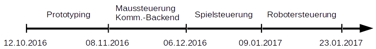

\newpage
# Projektverlauf & Entwicklungsprozess
Zur Bearbeitung des Projekts haben wir uns als selbstorganisierenden Team zusammengefunden.

Wir haben uns Meilensteine gesetzt, die das Gesamtprojekt in Etappen aufgeteilt haben.
Aus den Use Cases der momentanen Projektetappe wurden nötige Funktionalitäten und Subfunktionalitäten abgeleitet.
Diese wurden anfangs in JIRA als Issues hinzugefügt. Hierbei waren Dringlichkeit im Projektverlauf und Länge der Bestandszeit Kriterien der Reihenfolge der Abarbeitung der Issues.
Eine konkrete Aufteilung der Aufgaben gab es nicht. Jedes Teammitglied hat sich eine anstehende Aufgabe ausgesucht und diese dann bearbeitet.

Kurz nachdem die Issues für den dritten Meilenstein in JIRA eingetragen wurden, waren diese bereits abgearbeitet. 
Danach wurden diese nur noch erweitert und stabilisiert, so dass die Organisation durch JIRA nicht mehr benötigt wurde.

Die Funktionalität wurde durch Entwicklertests kontrolliert. Beim Auftreten von Fehlern wurden diese vermerkt und durch Debugging behoben.
Fehlende Funktionalitäten wurden als Issue hinzugefügt und nach oben genannten Kriterien abgearbeitet.

## Projektablauf

### Prototyping
Um eine geeignete Übertragungsart der Sensordaten zu finden und vertraut mit dem Server-Client-Konzept zu werden wurden Prototypen erstellt.
Hierbei wurden mehrere Varianten getestet: zum einem ob es besser ist Daten mit TCP oder UDP zu senden und zum anderen wurde verglichen, ob es besser ist den Server auf dem Smartphone oder auf dem Gerät, welches die Daten erhält, zu betreiben.

### Mouseserver & Kommunikations-Backend
Es wurde das Kommunikations-Backend erstellt, das die Kommunikation zwischen Server und Clients sicherstellt. Aufgrund der Zeitkritikalität und Indifferenz gegenüber fehlenden Paketen der Sensordaten haben wir uns hier für UDP entschieden. Der Befehlsaustausch erfolgt über TCP.

Parallel zur Fertigstellung des Kommunikations-Backends wurde eine Maussteuerung per Smartphone implementiert. Hierbei werden Gyroskopdaten verwendet und mit Hilfe der von Java vorgegebenen Robot-Klasse Inputs emuliert.

### Spielsteuerung
Für die Umsetzung einer Spielsteuerung haben wir uns für Super Mario Kart auf dem Super Nintendo Entertainment System entschieden, da hier wenige Buttons benötigt werden und die Möglichkeit der Verwendung von mehr als einem Sensor besteht.
Der Gravitationsensor wird zur Steuerung der Lenkbewegung und der lineare Beschleunigungssensor zur Steuerung des Itemwurfes verwendet.

### Robotersteuerung
Zur Lösung eines Murmellabyrinths mit Hilfe des Gravitationsensors des Smartphones wurde eine Steuerung für den KUKA LBR iiwa 7 R800 entworfen.

## Entwicklungswerkzeuge
Zur Entwicklung der Applikation wurde Android Studio und zur Entwicklung des Servers wurde IntelliJ IDEA verwendet. Als Version Control System diente Git, das Repository war auf GitHub gespeichert.

