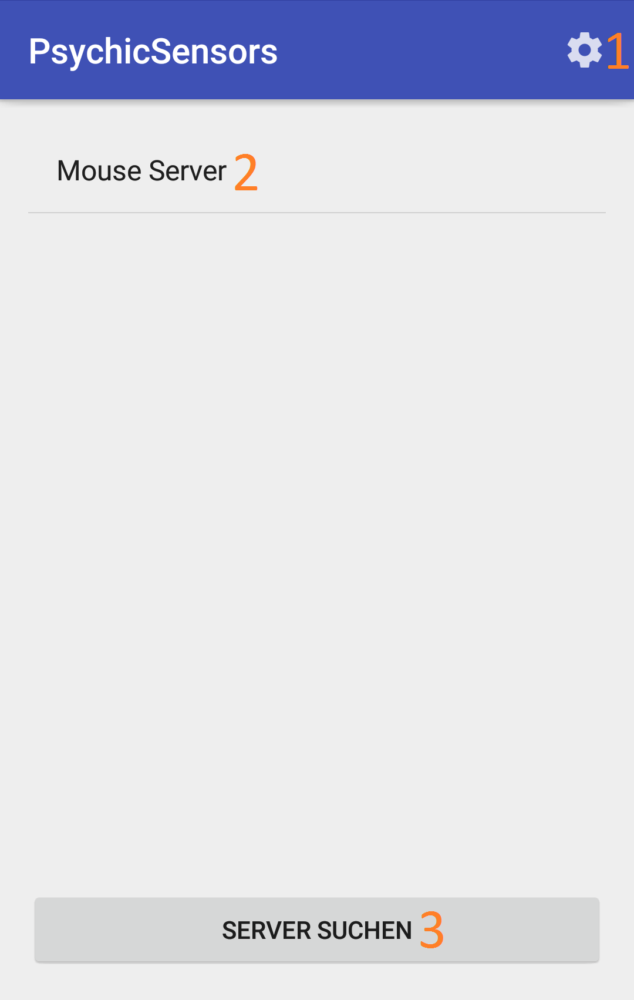
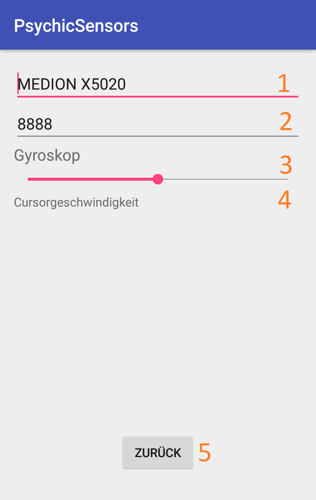
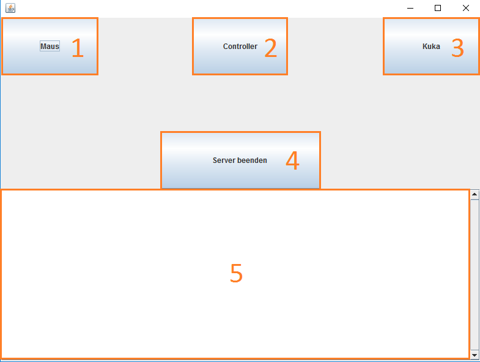
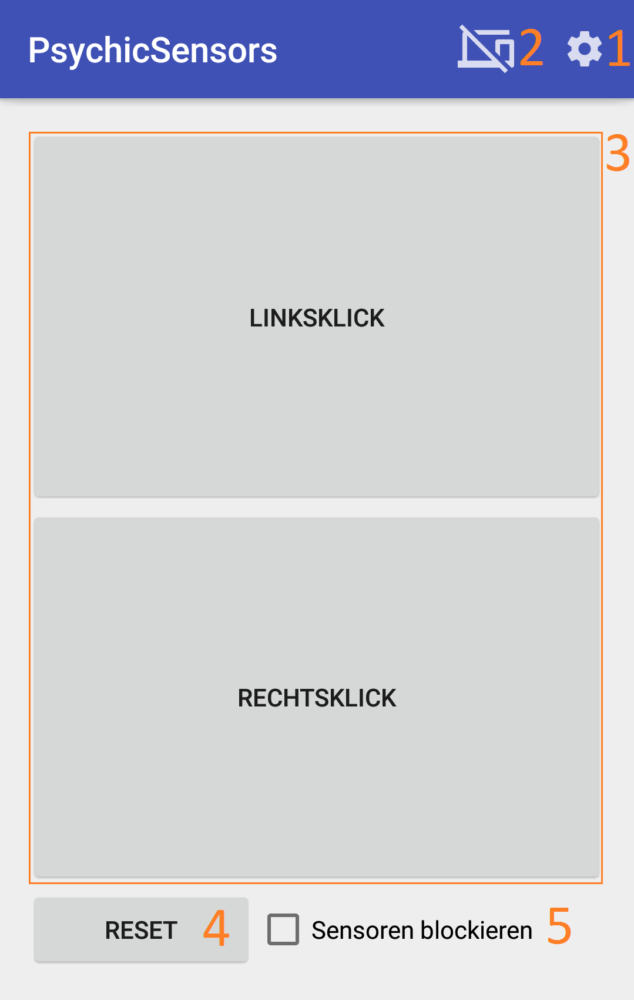

% Abschlussbericht Softwareprojekt: PsychicFramework
% Ulrich Bätjer; André Henniger; Markus Hempel; Arne Herdick
% 13.2.2017

# User-Guide
Die Bedienung von App und Server wird aus Sicht unserer Beispielimplementationen erläutert.

## Was benötigt wird: 

- Handy mit Android (__mindestens 4.4__) 
- javafähiges Gerät (__Java 8__) um Server darzustellen
- Server-Jar befindet sich auf dem Gerät
- Die App "PsychicSensors" ist auf dem Handy installiert
- Netzwerkverbindung (WLAN) zwischen Server und App

## Server starten:
Ein beliebiger Beispiel-Server kann mittels GUI gestartet werden. Alternativ kann auch ein spezifischer Beispiel-Server
über die Konsole mittels `java –jar server.jar <mouse|kuka|nes>` gestartet werden.

## App starten:

- App starten und auf "Server suchen" drücken
- gegebenenfalls Port über Option einstellen (darf nicht in Benutzung sein)
- gewünschten Server auswählen und verbinden

{ width=300px }

1. Optionen
2. Serve
3. Server suchen

## Einstellungen:
Hier lassen sich Name des Gerätes, benutzter Discovery Port und je nach gewählter Anwendung die Sensibilität der benutzbaren Sensoren des Handys einstellen (ist keine Anwendung gewählt, können alle Sensoren eingestellt werden).

{ width=300px }

1. Client-Name
2. Discoveryport
3. Sensorname und Empfindlichkeitsslider
4. Verwendungszweck des Sensors
5. Optionen verlassen

## GUI:
Die GUI kann mit einem Doppelklick auf `server.jar` gestartet werden, alternativ auch über die Konsole mit
`java –jar server.jar`. Die GUI ist nur für die 3 implementierten Beispielanwendungen erstellt worden. 
Änderungen dieser, oder eine neue GUI können durch den Implementierer erfolgen

{ width=300px }

1. Maus Server starten
2. Controller Server starten
3. KUKA Server starten
4. Aktuellen Server beenden
5. Feld für Serverinformationen

## Anwendungen:

### Maussteuerung:
Terminal Befehl: `java –jar server.jar mouse`

- das Handy verhält sich wie ein gedachter Laserpointer, womit der Mauszeiger bewegt werden kann. Idealerweise zeigt die Spitze des Handys bereits vor der Verbindung des Handys mit dem Server auf den Cursor.
- "Linksklick" und "Rechtsklick" verhalten sich wie Links- und Rechtsklick bei einer Maus
- "Reset" setzt den Cursor auf die Mitte des aktuellen Monitors (auf dem der Cursor sich gerade befindet)
- "Sensor anhalten" stoppt alle Bewegungen des Cursors (Cursor ist nicht mehr durch Handy steuerbar)

{ width=300px }

1. Optionen
2. Verbindung trennen
3. Vom Server angeforderte Bedienelemente
4. Rücksetzfunktion
5. Sensordatenübertragung pausieren

### Controller:
Terminal Befehl: `java –jar server.jar nes`

- Die Nutzung des Controllers ist hauptsächlich für die Emulation des Spieles "Super Mario Kart" gedacht, aber kann, wenn die Steuerungseinstellungen der Anwendung richtig konfiguriert wurde, auch für andere Rennspiele genutzt werden. Die "keys.properties" Datei enthält alle Steuerungsbelegungen und orientiert sich dabei am SNES-Kontroller 
- Für die Nutzung des Spieles "Super Mario Kart" wird am Besten der Emulator SNES9X verwendet. Die richtige Konfiguration des Emulators für die Verwendung dieser Anwendung befindet sich in der Datei snes9x.conf. Diese Datei muss sich lediglich im selben Ordner des Emulators befinden 
- vor Benutzung sollte unbedingt die gewünschte Anwendung vorher gestartet sein, da sonst unerwünschte Zeichen und Cursorbewegungen die Folge sein können
- zur Benutzung sollte das Handy um 90° nach links gekippt werden (wie ein Lenkrad)
- Für eine Lenkbewegung wird das Handy nun nach links oder rechts gekippt
- In den Optionen kann die Lenkempfindlichkeit eingestellt werden
- In Super Mario Kart wird mittels des B-Buttons etwas im Menü ausgewählt oder im Spiel beschleunigt
- Das Menü kann mittels einer "Stoßbewegung" vom Körper weg ein höherer bzw. einer Bewegung zum Körper hin ein unterer Menüpunkt gewählt werden. Im Spiel kann mittels derselben Bewegung ein Item nach vorne oder nach hinten geworfen werden, oder der A-Button betätigt werden
- Der Startbutton pausiert das Spiel
- die Buttons der App emulieren entsprechend der config Datei Tasten von einer Tastatur
- "Sensor anhalten" stoppt alle Sensordatenübertragungen 

### KUKA LBR iiwa 7 r800
Terminal Befehl: `java –jar server.jar vrep`

- Kuka Roboter "KUKA LBR iiwa 7 r800" oder entsprechende Simulationssoftware (vrep) ist erforderlich 
- Marble-Labyrinth-Control: Roboter steht in vordefinierter Position, zu bewegen ist nur das vorderste Gelenk
- alternativ: mit den Button "Wechsel zwischen Murmelmodus und Gelenkkontrolle" lässt sich jedes der Gelenke auswählen und einzeln bewegen
- "Sensor anhalten" stoppt alle Sensordatenübertragungen

### Weitere Anwendungen
Weitere Anwendungen und Tutorials müssen durch die Entwickler, die das Psychic-Framework benutzen, bereitgestellt werden

## Bekannte Probleme:

- benutzte Ports dürfen nicht von der Firewall blockiert werden
    - Lösung: neue Regel für die Firewall erstellen, in der dem Server erlaubt wird, mit dem Netzwerk zu kommunizieren
    - alternativ: Firewall deaktivieren

- unerwartetes Verhalten der Sensoren
    - Lösung: die Handysensoren neu kalibrieren

- Exception: "Address already in use: Cannot bind"
    - Lösung: anderen Discovery Port in den Einstellungen wählen
    
- Handy kann nicht zu Server verbinden
    - Lösung: im WLAN die Kommunikation zwischen Clients erlauben
    - alternativ: eigenes WLAN durch Hotspot erstellen
