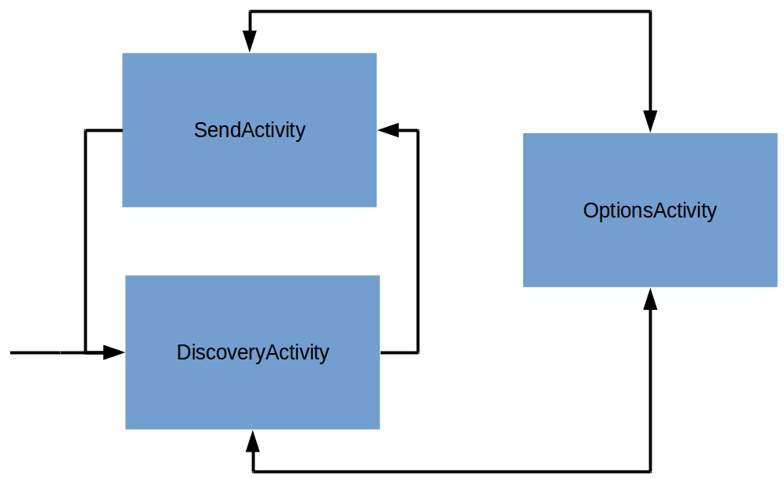
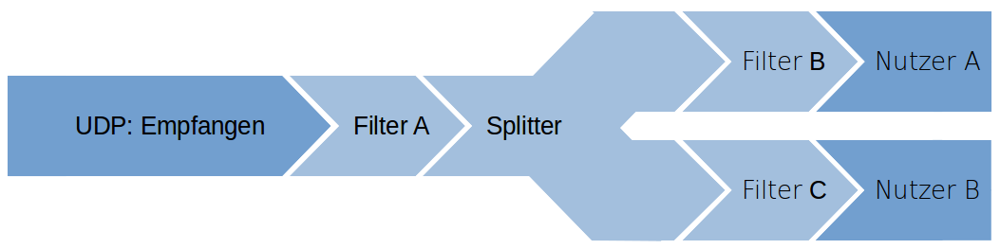

\newpage
# Analyse unserer Ergebnisse
Aus den Anforderungen ist ein Client-Server-Framework entstanden. Die Clients laufen in einer App auf Android-Geräten, und die Server sind Java-Anwendungen auf Endgeräten. Mit unserem Framework können andere Entwickler einfach Daten nutzen, die die Clients mithilfe ihrer Sensoren generieren und dann an den Server schicken, indem sie eine Java-Klasse erweitern. Im Folgenden stellen wir unsere Ergebnisse kurz vor und vergleichen sie mit den gestellten Anforderungen. Die im Projekt entstandene Architektur wird zum Ende der Analyse beschrieben.

## Verbindungsqualität

### Frequenz


Die blaue Linie gibt die Differenz zwischen den Ankunftszeiten der Sensordaten auf dem Server an. Die gelbe Linie ist der Durchschnitt dieser Zeiten, und die rote Linie im Hintergrund ist die Differenz zwischen den Zeitstempeln der Sensordaten.

Wie zu sehen ist, beträgt der durchschnittliche zeitliche Abstand zwischen Sensordaten ungefähr 20ms, was in einer Frequenz von 50Hz resultiert. Da 50Hz unsere Anforderung von 30 Sensordaten pro Sekunde deutlich überschreitet, sehen wir unsere Anforderung an die Update-Frequenz als mehr als erfüllt an.

\newpage
### Latenz


Die y-Achse ist in Millisekunden angegeben, die x-Achse gibt die Nummer der Messung seit ihrem Beginn an. Die blaue Linie ist die Round-Trip-Time (RTT) zwischen Server und Client für ein Kontrollpaket, dass vom Server geschickt wird und vom Client sofort beantwortet wird. Die gestrichelte grüne Linie ist der Mittelwert der RTTs. Wir haben die RTT als Messwert verwendet, damit wir uns nicht auf eine schwierige und potenziell ungenaue Uhrensynchronisation auf Server und Client verlassen müssen.

Wie zu sehen ist, liegt die durchschnittliche Round-Trip-Time bei 50ms; die Latenz zwischen Generierung der Sensordaten auf Clients und Eintreffem auf dem Server wird dementsprechend ungefähr bei 25 Millisekunden liegen. Wir sehen unsere Anforderung an die Latenz damit erfüllt.

\newpage
### Jitter


Die blaue Linie gibt den Betrag der Differenz zwischen den Periodizitäten der Sensordaten auf dem Server in Millisekunden an, die gestrichelte grüne Linie den durchschnittlichen Betrag des Jitters. Wie zu sehen ist, liegt der Betrag durchschnittlich bei ungefähr 3ms und zumeist unter 5ms.

In der Praxis waren diese Differenzen sowie die seltenen Spitzen nie zu spüren. Die Zeitstempel der Sensordaten ermöglichen es außerdem, verspätete Pakete zu ignorieren. Insofern stellt Jitter für uns kein Problem dar.

## Anforderungen der Steuerungen
Alle von uns geplanten Steuerungen wurden erfolgreich umgesetzt.
Unsere Anforderungen an die Netzwerkverbindungsqualität haben die Mindestanforderungen der drei Beispielimplementationen erreicht oder übertroffen, da die Steuerungen keine Probleme mit schlechten Reaktionszeiten zeigen.

### Maussteuerung
Mit den Buttons in der App ist es möglich, alle Funktionen einer einfachen Maus zu ersetzen: Man kann die Maus bewegen, auf Elemente des Bildschirms klicken, und klicken und ziehen, so dass auch das Scrollen durch Inhalte problemlos möglich ist. 

### Spielsteuerung
Nach ein wenig Eingewöhnungszeit ist es uns mit unserem Controller routinemäßig gelungen, die geforderten 1:20 zu unterbieten; es ist außerdem möglich, den Zwei-Spieler-Modus mit zwei Handys zu spielen. Die Itemwurfmechanik wird ebenfalls sowohl für rückwärts- als auch für vorwärtsgewandte Würfe unterstützt. 

### Robotersteuerung
Da wir unsere Steuerung leider nur in der Simulationsumgebung von V-REP testen können, können wir die erfolgreiche Lösung eines Murmellabyrinthes nicht testen. Wir gehen jedoch aufgrund unserer Erfahrungen mit der Maus- und Spielsteuerung sowie den Ergebnissen der Simulation davon aus, dass es möglich ist, ein Murmellabyrinth mit unserer Robotersteuerung zu lösen.

## Wiederverwendbarkeit
Letztlich ist es sehr einfach geworden, einen neuen Server zu implementieren, und es existiert eine umfassende Dokumentation sowie drei Beispiele, die bei einer neuen Implementation zu Hilfe stehen.
Mit unserer Unterstützung fast aller Sensoren sowie flexibler Buttonlayouts können unterschiedlichste Anwendungen entwickelt werden. Durch unsere Wahl Javas als Implementationssprache laufen Server auf Windows, Linux und Apple-Geräten, die JDK 8 oder höher installiert haben. Um die Verbindung zu einem Handy aufzubauen, müssen sich Server und Client im gleichen WLAN-Netzwerk mit Zwischenclientkommunikation befinden, ein Zustand, der in den meisten Heimnetzwerken gegeben ist. Alle Android-Geräte mit Unterstützung für API-Level 19, also Geräte mit mindestens Android 4.4 können die PsychicSensors-App installieren und werden somit als Client unterstützt.

Da wir uns gegen eine native Implementation von Eingabemethoden, zum Beispiel über Bluetooth HID-Profile, entschieden haben, ist der Entwickler nur durch die Java-Umgebung beschränkt, so lange er die gewünschten Funktionen nicht in einer nativen Programmiersprache umsetzt.

Wir sehen daher unsere Anforderung an das Framework, nicht nur von uns genutzt werden zu können, als erfüllt an.

## Bedienbarkeit der App
Das User Interface der App ist recht minimalistisch gehalten. Mit einem Knopfdruck werden Server gesucht, mit einem weiteren wird die Verbindung zu einem der gefundenen Server aufgebaut.
Es ist dem Nutzer möglich, eine Empfindlichkeit für die Sensoren festzulegen, die der Server dann je nach Anwendung interpretieren kann. Falls der Standard-Discovery-Port auf dem Endgerät, auf dem der Server läuft, blockiert ist, kann dieser in der App geändert werden. Insgesamt erfüllt die App unsere Anforderungen an den Client sehr gut, auch für gelegentliche Nutzer verständlich zu sein.

## Architektur
Die aus den Requirements entstandene Architektur wird im folgenden beschrieben. Das Psychic-Framework ist dreigeteilt in die App, den Server und einen gemeinsamen Kern. In dem Teil, der den Server enthält, befindet sich außerdem die Datenpipeline.


### Gemeinsamer Kern
Im gemeinsamen Kern (dem ```common```-Package) sind alle Klassen enthalten, die sowohl vom Server als auch von der App benötigt werden. Das sind unter anderem Klassen wie zum Beispiel ```SensorData```, ```SensorType``` oder ```AbstractCommand```, die in der Kommunikation verwendet werden, aber auch Klassen die vom Client und vom Server separat benutzt werden, z.B. ```ConnectionWatch``` oder ```DiscoveryThread```.

### Architektur der App
Die App ist dafür zuständig, den Nutzer Server finden zu lassen und mit Servern zu kommunizieren. Sie erlaubt es dem Nutzer außerdem, die Sensitivität für alle Sensoren zu ändern und den Gerätenamen festzulegen.
Wenn der Nutzer sich dafür entschieden hat, mit einem Server in Verbindung zu treten, wird die App anfangen, die Daten der angefragten Sensoren zu übermitteln. Außerdem stellt sie die vom Entwickler angefragten Buttons dar, und Benachrichtigt den Server über Knopfdrücke.



Die App startet in der ```DiscoveryActivity```. Hier wird durch den ```DiscoveryClient``` ein Broadcast auf einem DiscoveryPort nach verfügbaren Servern durchgeführt ([Server-Discovery](#server-discovery)). Bei Fund eines Servers wird dieser in der Activity angezeigt. Durch antippen des Servers wird in die ```SendActivity``` übergegangen.

Diese Activity instanziiert ```NetworkClient```, durch den eine Initialisierung der [```DataConnection```](#datenverbindung) und [```CommandConnection```](#kontrollverbindung) erfolgt.
Das serverspezifische Buttonlayout wird über die ```CommandConnection``` erhalten und mit Hilfe des ```LayoutParser``` umgesetzt. Die Verbindung zum Server kann durch das Betätigen des Disconnectbuttons beendet werden und man gelangt wieder in die ```DiscoveryActivity```.

Von beiden vorher genannten Activities gelangt man durch einen Knopfdruck in die ```OptionsActivity```. Hier lassen sich Sensitivitätseinstellungen der einzelnen Sensoren vornehmen.
Durch Betätigen des "Zurück"-Buttons gelangt man in die Activity, aus der die OptionsActivity aufgerufen wurde.

### Architektur des Servers


Die Architektur des Servers kann geteilt werden in den ```PsychicServer```-Teil, der die von uns geschriebenen Klassen beinhaltet, und den Teil, den der Entwickler erstellen muss. Der Server-Teil des Psychic-Frameworks dient dazu, die Erstellung von neuen Servern möglichst einfach zu machen. Beispiele befinden sich im ```examples```-Package. Siehe Abbildung \ref{server_arch}.


### PsychicServer-Teil
#### AbstractPsychicServer
Die Hauptklasse unserer Seite ist der ```AbstractPsychicServer```. Diese Klasse beinhaltet fast alle Funktionen, mit denen der Entwickler interagiert, zum Beispiel um Datensenken für Sensoren zu registrieren.
Die Klasse beinhaltet eine ```DataMapper```-Instanz, der von den ```ClientConnection```-Instanzen weitergeleitete Daten nach Client und Sensortyp aufgeschlüsselt an die registrierten Datensenken weiterleitet. Hier werden auch die Kontrollnachrichten, die nicht in der ```ClientConnection``` behandelt werden, behandelt. Das beinhaltet Knopfdrücke aller Clients, Resetevents aller Clients und Verbindungsanfragen, derer dann die Listenerimplementationen des Entwicklers benachrichtigt werden.

#### ClientConnection
Jeder Client wird von einer ```ClientConnection```-Instanz verwaltet. Jede dieser Instanzen wiederum besitzt eine ```DataConnection```- und eine ```CommandConnection```-Instanz. Die ```CommandConnection``` implementiert das Senden und Empfangen von ```AbstractCommand```-Objekten, und die ```DataConnection``` nimmt alle Sensordaten des Clients an. Die ```ClientConnection``` wird über Callbacks von Empfangsereignissen benachrichtigt. Die empfangenen Sensordaten werden mit der korrekten Nutzersensitivität an den ```DataMapper``` weitergeleitet. Mit Ausnahme von wenigen Kontrollnachrichten, die in der ```ClientConnection``` behandelt werden können, wie zum Beispiel die Nachrichten, die die Nutzersensitivität enthalten, werden alle an den ```AbstractPsychicServer``` weitergeleitet. Zusätzlich zu den Nutzersensitivitäten speichert jede ```ClientConnection``` auch den Wertebereich der Sensoren des verbundenen Handys.


#### ClientConnectionManager
Der ClientConnectionManager verwaltet alle ```ClientConnection```-Instanzen. Er speichert die vom Entwickler vorgegebenen Sensorengeschwindigkeiten, die Knopfkonfiguration und die benötigten Sensoren. Verändert sich der Zustand dieser Anforderungen, benachrichtigt der ```ClientConnectionManager``` alle verbundenen Clients. Zusätzlich können von dieser Klasse neue ```ClientConnection```-Instanzen angefragt werden.


### Entwicklerteil

#### Callbacks
Der Entwickler muss (oder kann, falls er die ```PsychicServer```-Klasse benutzt) die vier Interfaces ```ClientListener```, ```ResetListener```, ```ButtonListener``` und ```ExceptionListener``` implementieren. Er wird dann vom ```AbstractPsychicServer``` bei relevanten Ereignissen benachrichtigt.

#### NetworkDataSink
Der Entwickler kann außerdem beliebig viele Pipelines für Sensordaten registrieren, da die Pipelines das `NetworkDataSink`-Interface implementieren. Über diesen Weg werden die Sensordaten vom Entwickler genutzt.


### Daten-Pipeline


Die sogenannte Daten-Pipeline ist die Implementation der Sensordatenverarbeitung im Psychic-Framework. Alle Sensordaten, die den Server erreichen, werden durch eine vom Entwickler erstellbare Pipeline verarbeitet. Um ein Pipeline-Stück zu erstellen, muss lediglich ```AbstractFilter``` erweitert werden. Mehrere dieser Stücke können dann miteinander verbunden werden, so dass alle Daten die komplette Pipeline durchlaufen. Damit können zum Beispiel Gyroskopdaten erst mit einem Filter integriert werden, um sie danach zu glätten. Das letzte Element der Pipeline vor der Verwendung könnte dann z.B. noch zu kleine Ausschläge ignorieren, bevor die Daten schlussendlich der Anwendung aufbereitet zugeführt werden.

Die Pipeline unterstützt mithilfe von sogenannten Splittern auch das Weiterleiten von Sensordaten an mehrere separate weiterführende Pipelines.

### Server-Discovery


Grundlage der Serverfindung auf Endgerät und Handy ist der sogenannte  ```DiscoveryThread```, in dem sich Funktionen befinden, die von Server und Client benötigt werden. Wichtig sind für die Funktionsweise insbesondere ```sendSelfID```, ```listen``` und der ```onDiscovery```-Callback.

`sendSelfID` sendet die für weitere Kommunikation notwendigen Informationen in Form eines sich selbst beschreibenden NetworkDevice`. Der Client verwendet diese Funktion, um Server via Broadcast zu finden: Empfängt der Server ein solches Paket, wird ```onDiscovery``` aufgerufen, und der ```DiscoveryServer``` schickt an den Sender des Paketes seine eigene Identifikation via ```sendSelfID```. Dann ist der Server dem ```DiscoveryClient``` bekannt, und der ```onDiscovery```-Callback wird aufgerufen. Die App zeigt dem Nutzer den Server dann an, so dass dieser dem Client eine Verbindungsanfrage stellen kann. Erlaubt die Implementation dem Client die Verbindung, ist die Verbindung aufgebaut.

`listen` ist auf Client und Server dafür zuständig, per ```sendSelfID``` gesendete Pakete zu empfangen, und den `onDiscovery`-Callback auszulösen.
Der Port, auf dem der Server die Broadcasts erwartet, muss in der App eingegeben werden, falls nicht der Standardport ```8888``` verwendet wird.


### Kommunikation


Alle Daten und Commands werden als serialisierte Java-Objekte übertragen. Das Framework nutzt für alle Ports zufällige freie Ports, ausgenommen den für die Serverfindung genutzten, da dieser der App im Voraus bekannt sein muss. Daten nutzen eine unidirektionale Verbindung vom Client zum Server, während die Kontrollverbindung bidirektional ist

#### Kontrollverbindung
Die Kontrollverbindung läuft über TCP; für jede neue Kontrollnachricht wird eine neue Verbindung aufgebaut. Jede der Kontrollnachrichten ist ein ```AbstractCommand```. Diese Klasse enthält ein Enum, dass den Typ des Kontrollpakets beschreibt, so dass es einfach in die entsprechende Klasse gecastet werden kann. Diese Klassen können Instanzen aller serialisierbaren Klassen enthalten, so dass alle benötigten Daten einfach mitgeliefert werden können.

Da die Kontrollverbindung bidirektional ist, kann der Client auch ```AbstractCommand```-Objekte an den Server schicken. Das wird unter anderem für die Knöpfe verwendet, aber auch um den Server über den Wertebereich von Sensoren zu informieren.

#### Datenverbindung
Nachdem der Nutzer sich mit einem Server verbunden hat, übermittelt dieser die aktuell benötigte Konfiguration. Sobald die App diese umgesetzt hat, sind die benötigten Sensoren aktiviert. Alle generierten Daten werden ohne weitere Verarbeitung serialisiert und an den Datenport des Servers übermittelt, um den Rechenaufwand in der App möglichst gering zu halten. Die Übermittlung läuft über UDP, so dass kein expliziter Verbindungsaufbau für jedes Paket nötig ist. Die Serialisierung ist in Java händisch implementiert, so dass weder für Serialisierung noch für Deserialisierung aufwändige Reflection betrieben werden muss.