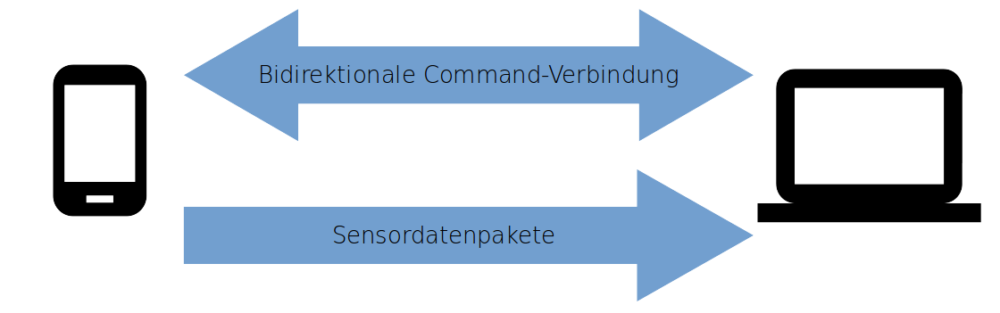
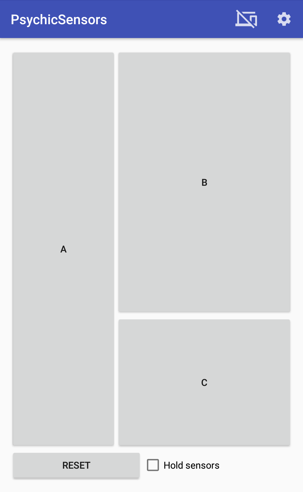
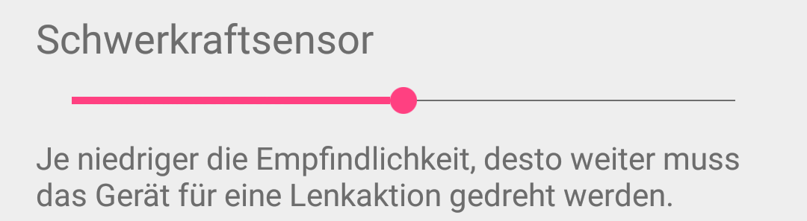

\newpage
# Inhaltsverzeichnis 

  * [Ziel](#ziel)
* [Usecase-Analyse](#usecase-analyse)
* [Requirements](#requirements)
    * [Verbindungsqualität](#verbindungsqualität)
    * [Maussteuerung](#maussteuerung)
    * [Spielsteuerung](#spielsteuerung)
    * [Robotersteuerung](#robotersteuerung)
    * [Framework](#framework)
    * [Bedienbarkeit](#bedienbarkeit)
* [Analyse unserer Ergebnisse](#analyse-unserer-ergebnisse)
    * [Framework](#framework)
    * [Bedienbarkeit der App](#bedienbarkeit-der-app)
    * [Latenz](#latenz)
    * [Frequenz](#frequenz)
    * [Jitter](#jitter)
    * [Anforderungen der drei Steuerungen](#anforderungen-der-drei-steuerungen)
* [Lessons learned](#lessons-learned)
* [Projektverlauf](#projektverlauf)
    * [Projektplan](#projektplan)
    * [Entwicklungsprozess](#entwicklungsprozess)
* [Architektur](#architektur)
    * [Gemeinsamer Kern](#gemeinsamer-kern)
    * [Architektur der App](#architektur-der-app)
    * [Architektur des Servers](#architektur-des-servers)
    * [Daten-Pipeline](#daten-pipeline)
    * [Server-Discovery](#server-discovery)
    * [Kommunikation](#kommunikation)
* [Developer Guide für das Psychic-Framework](#developer-guide-für-das-psychic-framework)
* [JavaDoc](#javadoc)
* [Grundlegende Verwendung:](#grundlegende-verwendung)
    * [Wichtige Hilfsklassen](#wichtige-hilfsklassen)
    * [Daten bestellen](#daten-bestellen)
    * [Daten abbestellen](#daten-abbestellen)
* [Verwendung von Buttons](#verwendung-von-buttons)
    * [Buttons zur Runtime anfordern](#buttons-zur-runtime-anfordern)
    * [Layouts laden](#layouts-laden)
* [Verwaltung von Clients](#verwaltung-von-clients)
    * [NetworkDevice](#networkdevice)
    * [Callbacks](#callbacks)
    * [Clientanzahl begrenzen](#clientanzahl-begrenzen)
* [Exceptionhandling](#exceptionhandling)
* [Resetevents](#resetevents)
    * [Reset-Button deaktivieren](#reset-button-deaktivieren)
* [Daten-Pipeline](#daten-pipeline)
    * [Format der Sensordaten: SensorData](#format-der-sensordaten-sensordata)
    * [NetworkDataSink](#networkdatasink)
    * [NetworkDataSource](#networkdatasource)
    * [Sensoren](#sensoren)
    * [Filter](#filter)
    * [Daten-Splitter](#daten-splitter)
    * [Pipeline-Builder](#pipeline-builder)
    * [Temporärer Stopp des Datenflusses](#temporärer-stopp-des-datenflusses)
* [Notifications anzeigen](#notifications-anzeigen)
* [Netzwerkverbindung](#netzwerkverbindung)
    * [Server-Discovery](#server-discovery)
    * [Datenverbindung](#datenverbindung)
    * [Kontrollverbindung](#kontrollverbindung)
* [License](#license)

\newpage
# Ziel
Das Ziel des Projekts war die Erstellung eines Frameworks zur Nutzung von Sensordaten von Androidgeräten auf javafähigen PCs und die Demonstration der Funktionalität dieses Frameworks anhand von drei Beispielanwendungen, nämlich einer Maussteuerung, einer Spielsteuerung und die Bedienung eines Murmellabyrinthes mithilfe eines Roboters.
Mit dem von uns erstellten Framework soll Drittpersonen die Umsetzung von Projekten mit Sensordaten erheblich erleichtert werden.


# Usecase-Analyse


Der AppBenutzer verwendet die App und einen vom Implementator vorgefertigten Server, um Sensordaten auf eine bestimmte Art zu verwenden.

Der Implementator nutzt das Framework, um einen Server mit gewünschter Funktionalität umzusetzen,
der dann von AppBenutzern verwendet werden kann.
Hierzu muss das Senden und Empfangen der Sensordaten über eine Verbindung zwischen App und Server, sowie das Verarbeiten dieser Daten berücksichtig werden.

Zur Demonstration dienen eine Maussteuerung, eine Robotersteuerung und ein GamePad zur Spielsteuerung.


# Requirements
Die zur Demonstration dienenden Anwendungen stellen schwer zu definierende Anforderungen an die Latenz und Frequenz der Sensordaten. Wir haben versucht, uns beim Festlegen der Grenzwerte auf bekannte Geräte zu beziehen, die keine Probleme bei der Bedienbarkeit haben.


## Verbindungsqualität

### Frequenz
Für die Frequenz der Sensordaten haben wir uns an der Playstation 3 von Sony orientiert: Diese stellt die laufenden Spiele mit 24 Bildern pro Sekunde dar, ein Wert mit dem die meisten Menschen problemlos auch schnelle Actionspiele bedienen können. Daraus entstand für uns die Anforderung, mindestens 30 Updates der Sensordaten pro Sekunde unterstützen zu können.


### Latenz
Eine akzeptable Grenze für die Latenz festzulegen war ebenfalls schwierig, da Latenzen im Millisekundenbereich nur schwerlich per Hand festzulegen sind. Wir haben daher versucht, uns über die Latenzen professionell hergestellter kabelloser Eingabegeräte zu informieren. Leider ist auch das schwierig, da Hersteller dazu meist keine Informationen veröffentlichen. Wir haben jedoch diesen Artikel von [www.eurogamer.net](http://www.eurogamer.net/articles/digitalfoundry-lag-factor-article?page=2) gefunden, die sich mit Input-Lag von Konsolen beschäftigt, und bei unterschiedlichen Spielen Unterschiede über 50ms gefunden. Da beide Spiele bedienbar sind, sollte eine Latenz unter diesem Wert keine Probleme verursachen.


### Jitter
Ein dritter Parameter für die Verbindungsqualität ist der Jitter, also wie sehr sich die Periodizität der ankommenden Sensordaten von der Periodizität der gesendeten Sensordaten unterscheidet. Je geringer der Jitter ist, desto besser ist die Verbindung. Unsere einzige Anforderung an diesen Aspekt der Verbindung war, dass sich kein Jitter bemerkbar macht.


## Maussteuerung
Zusätzlich zu den Anforderungen an die Netzwerkparameter, die flüssige und direkte Steuerung garantieren sollen, muss die Maus auch Knöpfe zur Verfügung stellen, um eine normale Maus zu emulieren.


## Spielsteuerung
Für die Spielsteuerung haben wir einen SNES-Controller emuliert, mit dem wir das Spiel „Super Mario Kart“ spielen können. Wir haben uns für dieses Spiel entschieden, weil für die meisten Spiele sehr viele Knöpfe benötigt werden, die auf einem Touchscreen ohne haptisches Feedback schwer zu bedienen sind während man auf das Spiel schaut.
Um die Anforderungen an die Spielbarkeit festzulegen, haben wir die Zeiten einiger Läufe mit nativen Controllern auf der ersten Karte des Spiels, "Mario Circuit 1", gemessen. Dadurch hatten wir einen Vergleichswert von 1:20, die wir mit unserem Controller mindestens erreichen wollten, bei der dieser einem nativen Controller ähnlich ist.

Außerdem sollte die Anordnung der Buttons in etwa dem nativen Controller entsprechen, weshalb ein flexibles Layouting vom Server aus möglich sein muss.

Um die Itemmechanik von "Super Mario Kart" zu unterstützen, wollten wir lineare Bewegungen in einer separaten Achse auswerten, was die gleichzeitige Nutzung mehrerer Sensoren erforderte.

Außerdem besitzt das Spiel einen Mehrspielermodus, den wir ebenfalls unterstützen wollten, weshalb wir mehrere Clients zur gleichen Zeit annehmen können mussten.


## Robotersteuerung
Die Robotersteuerung stellt keine Anforderungen, die nicht bereits durch die Maussteuerung und der Spielsteuerung gestellt wurden, da die Anforderungen an Latenz und Frequenz nicht höher sind, und Buttons auch schon von der Maus- und Spielsteuerung benötigt werden.


## Framework
Da wir ein entwicklerfreundliches Framework erstellen wollten, mussten wir darauf achten dass unser Projekt nicht nur für unsere Beispiele nutzbar ist.
Es sollte nicht notwendig sein, die App zu verändern, um andere Applikationen zu entwickeln. Wichtig war auch, alle möglichen Anforderungen an die Nachbearbeitung der Daten auf dem Server unterstützen zu können.

Außerdem wollten wir die Anforderungen an den PC für den Server und das Handy für die App möglichst gering halten.


## Bedienbarkeit
Die App sollte möglichst benutzerfreundlich erstellt sein. Das bedeutete für uns, möglichst wenig Konfiguration vom Nutzer zu fordern.


# Analyse unserer Ergebnisse

## Framework
Letztlich ist es sehr einfach geworden, einen neuen Server zu implementieren.
Mit unserer Unterstützung aller Sensoren, die kontinuierlich Daten schicken und bis API-Level 19 zu Android hinzugefügt wurden, können unterschiedlichste Anwendungen entwickelt werden.
Mit unserer Unterstützung für vom Implementator festgelegte Buttonlayouts werden auch hier die möglichen Anwendungen möglichst wenig eingeschränkt. Mit unserer Wahl von Java als Implementationssprache laufen Server auf Windows, Linux und Apple-Geräten, die JDK 8 oder höher installiert haben. Um die Verbindung zu einem Handy aufzubauen, müssen sich Server und Client im gleichen WLAN-Netzwerk mit Zwischenclientkommunikation befinden, ein Zustand, der in den meisten Heimnetzwerken gegeben ist. Alle Android-Geräte mit Unterstützung für API-Level 19, also alle Geräte mit mindestens Android 4.4 können die PsychicSensors-App installieren, werden also als Client unterstützt.


## Bedienbarkeit der App
Das User Interface der App ist recht minimalistisch gehalten. Mit einem Knopfdruck werden Server gesucht, mit einem weiteren wird die Verbindung zu einem der gefundenen Server aufgebaut.
Es ist dem Nutzer möglich, eine Empfindlichkeit für die Sensoren festzulegen, die der Server dann je nach Anwendung interpretieren kann.
Falls der Standard-Discovery-Port auf dem PC auf dem der Server läuft blockiert ist, kann dieser in der App geändert werden.
Insgesamt erfüllt die App unsere Anforderungen an den Client sehr gut.


## Latenz


Die y-Achse ist in Millisekunden angegeben. Da sich die Timestamps des Handys und des Servers nie exakt synchronisieren lassen, haben wir die Round-Trip-Time gemessen. Wie zu sehen ist, liegt die durchschnittliche Round-Trip-Time bei 50ms; die Latenz zwischen Generierung der Sensordaten wird dementsprechend ungefähr bei 25 Millisekunden liegen. Wir sehen unsere Anforderung an die Latenz damit erfüllt.


## Frequenz


Die y-Achse ist in Millisekunden angegeben. Da sich die Timestamps des Handys und des Servers nie exakt synchronisieren lassen, lässt sich hier nur die Differenz zwischen den Ankunftszeiten auf dem PC, und den Sensor-Event-Timestamps auf dem Handy berechnen. Wie zu sehen ist, ist der Durchschnitt der Abstände zwischen dem Ankommen von Sensordaten ungefähr 20ms, was in einer Frequenz von 50Hz resultiert. Da 50Hz unsere Anforderung von 30Hz deutlich überschreitet, sehen wir auch dieses Requirement als erfüllt an.


## Jitter


Die y-Achse ist in Millisekunden angegeben. Wie zu sehen ist, bleibt die Differenz zwischen den Periodizitäten zumeist unter 10ms. In der Praxis waren diese Differenzen nie zu spüren. Da die Zeitstempel der Sensordaten übertragen werden, ist es auch möglich verspätete Pakete zu ignorieren.


## Anforderungen der drei Steuerungen
Unsere Anforderungen an die Netzwerkverbindungsqualität haben die Mindestanforderungen der drei Beispielimplementationen erreicht oder übertroffen, da die Steuerungen keine Probleme mit schlechten Reaktionszeiten zeigen.


# Lessons learned
Es ist deutlich effektiver sich gemeinsam zu festen Zeiten zu treffen, um zusammen zu arbeiten als allein. Dadurch haben wir direktes Feedback zu neuen Ideen und deren Umsetzungen von den anderen Teammitgliedern bekommen. Pairprogramming erlaubt Diskussionen und konstruktive Lösungen von neuen Problemen durch andere zu erhalten.
Uns fiel es schwer Grenzwerte für messbare Requirements zu erstellen, die das Projekt beschreiben.
Ein frühzeitiges Festlegen des deployment formats verhindert die Benutzung von Softwarearchitekturen, die eine spätere Bereitstellung der Software erschweren.

# Projektverlauf

## Projektplan


### Prototyping
Um eine geeignete Übertragungsart der Sensordaten zu finden und vertraut mit dem Server-Client-Konzept zu werden wurden Prototypen erstellt.
Hierbei wurden mehrere Varianten getestet: zum einem ob es besser ist Daten mit TCP oder UDP zu senden und zum anderen wurde verglichen, ob es besser ist den Server auf dem Smartphone oder auf dem PC zu betreiben.


### Mouseserver & Kommunikations-Backend
Es wurde das Kommunikations-Backend erstellt, das die Kommunikation zwischen Server und Clients sicherstellt. Aufgrund der Zeitkritikalität und Indifferenz gegenüber fehlenden Paketen der Sensordaten haben wir uns hier für UDP entschieden. Der Befehlsaustausch erfolgt über TCP.

Parallel zur Fertigstellung des Kommunikations-Backends wurde eine Maussteuerung per Smartphone implementiert. Hierbei werden Gyroskopdaten verwendet und mit Hilfe der von Java vorgegebnen Robot-Klasse Inputs emuliert.


### Spielsteuerung
Für die Umsetzung einer Spielsteuerung haben wir uns für Super Mario Kart auf dem Super Nintendo Entertainment System entschieden, da hier wenige Buttons benötigt werden und die Möglichkeit der Verwendung von mehr als einem Sensor besteht.
Der Gravitationsensor wird zur Steuerung der Lenkbewegung und der lineare Beschleunigungssensor zur Steuerung des Itemwurfes verwendet.

### Robotersteuerung
Zur Lösung eines Murmellabyrinths mit Hilfe des Gravitationsensors des Smartphones wurde eine Steuerung für den KUKA LBR iiwa R800 entworfen.


## Entwicklungsprozess
Zur Entwicklung der Applikation wurde Android Studio und zur Entwicklung des Servers wurde IntelliJ IDEA verwendet. Als Version Control System diente Git.

Aus am Anfang erstellten Use Cases wurden benötigte Funktionen und Subfunktionen abgeleitet. Diese wurden anfangs in JIRA eingetragen und nach und nach abgearbeitet.
Bei Auftreten eines Problems oder einer fehlenden Funktionalität wurde ein neuer Issue erstellt und hinzugefügt.

Wir haben uns keine Aufteilung der Aufgaben festgelegt. Issues wurden nach ihrer Dringlichkeit im Projektverlauf und der Länge ihrer Bestandszeit geordnet abgearbeitet.

# Architektur
Das Psychic-Framework ist dreigeteilt in die App, den Server und einen gemeinsamen Kern. In dem Teil, der den Server enthält, befindet sich außerdem die Datenpipeline.


## Gemeinsamer Kern
Im gemeinsamen Kern (dem ```common```-Package) sind alle Klassen enthalten, die sowohl vom Server als auch von der App benötigt werden. Das sind unter anderem Klassen wie zum Beispiel ```SensorData```, ```SensorType``` oder ```AbstractCommand```, die in der Kommunikation verwendet werden, aber auch Klassen die vom Client und vom Server separat benutzt werden, z.B. ```ConnectionWatch``` oder ```DiscoveryThread```.


## Architektur der App
Die App ist dafür zuständig, den Nutzer Server finden zu lassen und mit Servern zu kommunizieren. Sie erlaubt es dem Nutzer außerdem, die Sensitivität für alle Sensoren zu ändern und den Gerätenamen festzulegen.
Wenn der Nutzer sich dafür entschieden hat, mit einem Server in Verbindung zu treten, wird die App anfangen, die Daten der angefragten Sensoren zu übermitteln. Außerdem stellt sie die vom Implementator angefragten Buttons dar, und Benachrichtigt den Server über Knopfdrücke.


Die App startet in der ```DiscoveryActivity```. Hier wird durch den ```DiscoveryClient``` ein Broadcast auf einem DiscoveryPort nach verfügbaren Servern durchgeführt ([Server-Discovery](#server-discovery)). Bei Fund eines Servers wird dieser in der Activity angezeigt. Durch Click des Servers wird in die ```SendActivity``` übergegangen.

Diese Activity instanziiert ```NetworkClient```, durch den eine Initialisierung der [```DataConnection```](#datenverbindung) und [```CommandConnection```](#kontrollverbindung) erfolgt.
Das serverspezifische Buttonlayout wird über die ```CommandConnection``` erhalten und mit Hilfe des ```LayoutParser``` umgesetzt. Die Verbindung zum Server kann durch das Betätigen des Disconnectbuttons beendet werden und man gelangt wieder in die ```DiscoveryActivity```.

Von beiden vorher genannten Activities gelangt man durch einen Knopfdruck in die ```OptionsActivity```. Hier lassen sich Sensitivitätseinstellungen der einzelnen Sensoren vornehmen.
Durch Betätigen des "Zurück"-Buttons gelangt man in die Activity, aus der die OptionsActivity aufgerufen wurde.

## Architektur des Servers


Die Architektur des Servers kann geteilt werden in den ```PsychicServer```-Teil, der die von uns geschriebenen Klassen beinhaltet, und den Teil, den der Implementator erstellen muss. Der Server-Teil des Psychic-Frameworks dient dazu, die Erstellung von neuen Servern möglichst einfach zu machen. Beispiele lassen befinden sich im ```examples```-Package.


### PsychicServer-Teil
#### AbstractPsychicServer
Die Hauptklasse unserer Seite ist der ```AbstractPsychicServer```. Diese Klasse beinhaltet fast alle Funktionen, mit denen der Implementator interagiert, zum Beispiel um Datensenken für Sensoren zu registrieren.
Die Klasse beinhaltet eine ```DataMapper```-Instanz, der von den ```ClientConnection```-Instanzen weitergeleitete Daten nach Client und Sensortyp aufgeschlüsselt an die registrierten Datensenken weiterleitet. Hier werden auch die Kontrollnachrichten, die nicht in der ```ClientConnection``` behandelt werden, behandelt. Das beinhaltet Knopfdrücke aller Clients, Resetevents aller Clients und Verbindungsanfragen, derer dann die Listenerimplementationen des Implementators benachrichtigt werden.


#### ClientConnection
Jeder Client wird von einer ```ClientConnection```-Instanz verwaltet. Jede dieser Instanzen wiederum besitzt eine ```DataConnection```- und eine ```CommandConnection```-Instanz. Die ```CommandConnection``` implementiert das Senden und Empfangen von ```AbstractCommand```-Objekten, und die ```DataConnection``` nimmt alle Sensordaten des Clients an. Die ```ClientConnection``` wird über Callbacks von Empfangsereignissen benachrichtigt. Die empfangenen Sensordaten werden mit der korrekten Nutzersensitivität an den ```DataMapper``` weitergeleitet. Mit Ausnahme von wenigen Kontrollnachrichten, die in der ```ClientConnection``` behandelt werden können, wie zum Beispiel die Nachrichten, die die Nutzersensitivität enthalten, werden alle an den ```AbstractPsychicServer``` weitergeleitet. Zusätzlich zu den Nutzersensitivitäten speichert jede ```ClientConnection``` auch den Wertebereich der Sensoren des verbundenen Handys.


#### ClientConnectionManager
Der ClientConnectionManager verwaltet alle ```ClientConnection```-Instanzen. Er speichert die vom Implementator vorgegebenen Sensorengeschwindigkeiten, die Knopfkonfiguration und die benötigten Sensoren. Verändert sich der Zustand dieser Anforderungen, benachrichtigt der ```ClientConnectionManager``` alle verbundenen Clients. Zusätzlich können von dieser Klasse neue ```ClientConnection```-Instanzen angefragt werden.


### Implementatorteil

#### Callbacks
Der Implementator muss (oder kann, falls er die ```PsychicServer```-Klasse benutzt) die vier Interfaces ```ClientListener```, ```ResetListener```, ```ButtonListener``` und ```ExceptionListener``` implementieren. Er wird dann vom ```AbstractPsychicServer``` bei relevanten Ereignissen benachrichtigt.


## Daten-Pipeline
Die sogenannte Daten-Pipeline ist die Implementation der Sensordatenverarbeitung im Psychic-Framework. Alle Sensordaten, die den Server erreichen, werden durch eine vom Implementator erstellbare Pipeline verarbeitet. Um eine Pipeline-Stück zu erstellen, muss lediglich ```AbstractFilter``` erweitert werden. Mehrere dieser Stücke können dann miteinander verbunden werden, so dass alle Daten die komplette Pipeline durchlaufen. Damit können zum Beispiel Gyroskopdaten erst mit einem Filter integriert werden, um sie danach zu glätten. Das letzte Element der Pipeline vor der Verwendung könnte dann z.B. noch zu kleine Ausschläge ignorieren, bevor die Daten schlussendlich der Anwendung aufbereitet zugeführt werden. 

Die Pipeline unterstützt auch das Weiterleiten von Sensordaten an mehrere seperate weiterführende Pipelines.

## Server-Discovery


Grundlage der Serverfindung auf PC und Handy ist der sogenannte  ```DiscoveryThread```, in dem sich Funktionen befinden, die von Server und Client benötigen. Wichtig sind für die Funktionsweise insbesondere ```sendSelfID```, ```listen``` und der ```onDiscovery```-Callback.

```sendSelfID``` sendet die für weitere Kommunikation notwendigen Informationen in Form eines sich selbst beschreibenden ```NetworkDevice```. Der Client verwendet diese Funktion, um Server via Broadcast zu finden: Empfängt der Server ein solches Paket, wird ```onDiscovery``` aufgerufen, und der ```DiscoveryServer``` schickt an den Sender des Paketes seine eigene Identifikation via ```sendSelfID```. Dann ist der Server dem ```DiscoveryClient``` bekannt, und der ```onDiscovery```-Callback wird aufgerufen. Die App zeigt dem Nutzer den Server dann an, so dass dieser dem Client eine Verbindungsanfrage stellen kann. Erlaubt die Implementation dem Client die Verbindung, ist die Verbindung aufgebaut.

```listen``` ist auf Client und Server dafür zuständig, per ```sendSelfID``` gesendete Pakete zu empfangen, und den ```onDiscovery```-Callback auszulösen.
Der Port, auf dem der Server die Broadcasts erwartet, muss in der App eingegeben werden, falls nicht der Standardport ```8888``` verwendet wird.


## Kommunikation

Alle Daten und Commands werden als serialisierte Java-Objekte übertragen. Das Framework nutzt für alle Ports zufällige freie Ports, ausgenommen den für die Serverfindung genutzten, da dieser der App im Voraus bekannt sein muss. Daten nutzen eine unidirektionale Verbindung vom Client zum Server, während die Kontrollverbindung bidirektional ist

### Kontrollverbindung
Die Kontrollverbindung läuft über TCP; für jede neue Kontrollnachricht wird eine neue Verbindung aufgebaut. Jede der Kontrollnachrichten ist ein ```AbstractCommand```. Diese Klasse enthält ein Enum, dass den Typ des Kontrollpakets beschreibt, so dass es einfach in die entsprechende Klasse gecastet werden kann. Diese Klassen können Instanzen aller serialisierbaren Klassen enthalten, so dass alle benötigten Daten einfach mitgeliefert werden können.

Da die Kontrollverbindung bidirektional ist, kann der Client auch ```AbstractCommand```-Objekte an den Server schicken. Das wird unter anderem für die Knöpfe verwendet, aber auch um den Server über den Wertebereich von Sensoren zu informieren.


### Datenverbindung
Nachdem der Nutzer sich mit einem Server verbunden hat, übermittelt dieser die aktuell benötigte Konfiguration. Nachdem die App diese umgesetzt hat, sind die benötigten Sensoren aktiviert. Alle generierten Daten werden ohne weitere Verarbeitung serialisiert und an den Datenport des Servers übermittelt, um den Rechenaufwand in der App möglichst gering zu halten. Die Übermittlung läuft über UDP, so dass kein expliziter Verbindungsaufbau für jedes Paket nötig ist.
# TODO
* Sonstiges:
    - JavaDoc einbauen
    - PLAY STORE
        + link zu release
    - javadoc ist teilweise horribly out of date. wir müssen zumindest bei dem kram den die potenziell angucken korrigieren!
    - github release mit: framework code als zip, framework als jar, beispielserver gui als jar
* DeveloperGuide.md
    - how to use framework mit intellij
* Einleitung.md
* Architektur.md
    - klassendiagramm anhängen


# Developer Guide für das Psychic-Framework
Das Psychic-Framework bezeichnet eine Kombination aus einer App und einem Serverframework mit einem gemeinsamen Kern. Dieses Framework dient der schnellen und einfachen Entwicklung von PC-Applikationen, die Sensordaten von Android-Geräten verwenden möchten.


# JavaDoc
Eine komplette JavaDoc ist verfügbar unter TODO


# Grundlegende Verwendung:
Es gibt zwei Möglichkeiten einen Server zu implementieren: Entweder wird ```AbstractPsychicServer``` erweitert, oder ein ```PsychicServer``` wird instanziiert.

Wenn ```AbstractPsychicServer``` erweitert wurde, müssen folgende Interfaces implementiert werden:

* [ButtonListener](#verwendung-von-buttons)
* [ClientListener](#verwaltung-von-clients)
* [ResetListener](#resetevents)
* [ExceptionListener](#exceptionhandling)

Wenn ein ```PsychicServer``` instanziiert wurde, kann gewählt werden welche Interfaces interessant sind; für jedes kann ein Listener mit einer der folgenden Funktionen registriert werden:

* ```setButtonListener(ButtonListener)```
* ```setClientListener(ClientListener)```
* ```setResetListener(ResetListener)```
* ```setExceptionListener(ExceptionListener)```


Nachdem ein Server mit ```start()``` gestartet wurde, können sich Clients verbinden. Wird ein Server mit ```close()``` geschlossen werden alle Clients getrennt. Die Instanz kann nicht wieder verwendet werden, ein weiterer Aufruf von ```start()``` wird eine Exception erzeugen.

> Hinweis: Falls nicht anders angegeben, befinden sich alle nachfolgend genannten Funktionen im ```AbstractPsychicServer```, sind also auch im ```PsychicServer``` verfügbar.

Sind die Interfaces implementiert, fehlt noch der eigentlich wichtigste Schritt: Es müssen Daten von den Clients angefragt werden.


## Wichtige Hilfsklassen
Weil viele der folgenden Erklärungen diese Klassen benutzen, werden sie hier kurz erwähnt:

* ```SensorType```-Enum: Alle unterstützten Sensoren. [Dokumentation](#sensoren)
* ```NetworkDevice```: Identifiziert einen Client. [Dokumentation](#networkdevice)
  - ```getName()```: Name des Clients
  - ```getAddress()```: IP-Adresse des Clients
* ```NetworkDataSink```: Dieses Interface ermöglicht implementierenden Klassen, Sensordaten anzunehmen. [Dokumentation](#networkdatasink)


## Daten bestellen
Das Kernthema des Psychic-Frameworks sind Sensordaten. Diese werden zuerst an eine ```NetworkDataSink``` geleitet, und werden mit der ```registerDataSink(NetworkDataSink, SensorType)```-Funktion angefordert. Die übergebene ```NetworkDataSink``` wird dann die unveränderten Daten von dem durch den ```SensorType```-Parameter angegebenen Sensor erhalten. [Die Verwendung von ```NetworkDataSink``` sowie die ```onData```-Funktion werden hier genauer beschrieben.](#networkdatasink)

Sollen nur Daten eines einzelnen Clients an eine Datensenke gelangen, steht ```registerDataSink(NetworkDataSink, NetworkDevice, SensorData)``` zur Verfügung. Wird diese Funktion genutzt, werden nur Daten vom spezifizierten ```NetworkDevice``` an der übergebenen ```NetworkDataSink``` ankommen.

Sensordaten lassen sich mit dem Psychic-Framework am besten mithilfe der [Daten-Pipeline](#daten-pipeline) bearbeiten, bis sie der Anwendung genügen.


### Beispiel einer Serverinstanziierung
```Java
public class ExampleServer implements NetworkDataSink {
    public ExampleServer() throws IOException {
        Server server = new Server();
        server.start();
        server.registerDataSink(this, SensorType.Gyroscope);
    }

    public void onData(NetworkDevice origin, SensorData sensorData, float userSensitivity){
      System.out.println("received" + Arrays.toString(sensorData.data));
    }

    public void close(){
    }
}
```


## Daten abbestellen
Wenn eine ```NetworkDataSink``` nicht mehr benötigt wird, zum Beispiel weil der entsprechende Client getrennt wurde, kann sie mit ```unregisterDataSink(NetworkDataSink)``` von allen Sensoren abgemeldet werden, und mit  ```unregisterDataSink(NetworkDataSink, SensorType)``` von bestimmten Sensoren abgemeldet werden. Danach erhält die ```NetworkDataSink``` keine Daten mehr vom Server.


# Verwendung von Buttons
```Java
// aus dem ButtonListener Interface
void onButtonClick(ButtonClick click, NetworkDevice origin) {
    if(click.getId() == MY_BUTTON_ID)
        System.out.println("Button MY_BUTTON is currently held: " + click.isPressed());
}
```

Um über Knopfdrücke informiert zu werden, muss ein ```ButtonListener``` registriert werden. Der ```Server``` hat dafür die ```setButtonListener(ButtonListener)```-Funktion.  
Unterklassen des ```AbstractPsychicServer``` müssen das Interface ohnehin implementieren.

Innerhalb der ```onButtonClick(ButtonClick, NetworkDevice)``` kann der Button mithilfe von ```click.getId()``` identifiziert werden, und ```click.isPressed()``` ist ```true``` wenn der Button gedrückt und ```false``` wenn der Button losgelassen wurde.

Buttons werden immer auf allen verbundenen Clients angezeigt.


## Buttons zur Runtime anfordern
Buttons können mit ```addButton(String, int)``` hinzugefügt werden. Der ```String``` ist der Text, den der Button anzeigt, der ```int``` ist die ID, die beim Drücken des Buttons an den Server gesendet wird. Zum Entfernen einzelner Buttons kann ```removeButtons(int)``` verwendet werden.
Ein Aufruf von ```setButtonLayout(String)``` oder ```clearButtons()``` wird alle mit ```addButton``` hinzugefügten Knöpfe entfernen.


## Layouts laden
Eine Alternative ist die Verwendung von ```setButtonLayout(String)```. Hierbei kann eine eigene Android-XML-Layout-Datei als ```String``` übergeben werden.  


### Einschränkungen für die Layout-Dateien
Es werden nur ```LinearLayout```- und ```Button```-Objekte unterstützt. Ein Beispiel für einen unterstützten XML-String ist das folgende Snippet:

```xml
<?xml version="1.0" encoding="utf-8"?>
<LinearLayout
    xmlns:android="http://schemas.android.com/apk/res/android"
    android:orientation="horizontal">

    <Button
        android:text="A"
        android:id="0"
        android:layout_weight="3"/>

    <LinearLayout
        android:orientation="vertical"
        android:layout_weight="5">

        <Button
            android:text="B"
            android:id="1"
            android:layout_weight="2" />

        <Button
            android:text="C"
            android:id="2"
            android:layout_weight="1" />
    </LinearLayout>
</LinearLayout>
```

Layout-String, wie er in der App angezeigt wird:
<p align="center"></p>

```Button```-Elemente unterstützen ausschließlich die folgenden Attribute:

* ```android:text=""``` enthält den vom Button dargestellten Text
* ```android:id=""``` ist die ID, die an den Server übertragen wird, und dort mithilfe von ```ButtonClick.getId()``` abgefragt werden kann
* ```android:layout_weight=""``` wird direkt für den Button gesetzt. Genaue Informationen sind in der [Android-Dokumentation](https://developer.android.com/guide/topics/ui/layout/linear.html#Weight) zu finden.

```LinearLayout```-Elemente unterstützen ausschließlich die folgenden Attribute:

* ```android:layout_weight=""``` wird direkt für das Layout gesetzt. Genaue Informationen sind in der [Android-Dokumentation](https://developer.android.com/guide/topics/ui/layout/linear.html#Weight) zu finden.
* ```android:orientation=""``` wird direkt für das Layout gesetzt. Genaue Informationen sind in der [Android-Dokumentation](https://developer.android.com/reference/android/widget/LinearLayout.html#attr_android:orientation) zu finden.

Bei Verwendung von ```setButtonLayout(String)``` werden alle durch ```addButton(String, int)``` hinzugefügten Buttons entfernt und bei
Verwendung von ```addButton(String, int)``` wird das durch ```setButtonLayout``` erstellte Layout entfernt.

Um alle Buttons zu entfernen kann ```clearButtons()``` aufgerufen werden.


# Verwaltung von Clients
Um die verschiedenen Client-Events zu handeln, muss ein ```ClientListener``` gesetzt werden, der die Events empfängt. Die Server-Klasse hat dafür den ```setClientListener(ClientListener)```-Befehl.

Beispiel-Implementationen der Funktionen aus dem ```ClientListener```-Interface:
```Java
boolean acceptClient(NetworkDevice newClient){
    return true; // accept any client
}
void onClientDisconnected(NetworkDevice disconnectedClient){
    System.out.println("Oh no! Client " + disconnectedClient.getName() + " has disconnected!")
}
void onClientTimeout(NetworkDevice timeoutClient){
    System.out.println("Oh no! Client " + disconnectedClient.getName() + " had a timeout!")
}
void onClientAccepted(NetworkDevice connectedClient){
    System.out.println("A new client, " + disconnectedClient.getName() + " has connected!")
}
```


## NetworkDevice
Clients werden als ```NetworkDevice``` angegeben. Mit ```getInetAddress()``` kann die aktuelle IP-Adresse als ```InetAddress``` abgefragt werden und unter ```getName()``` ist der Name des ```NetworkDevice``` verfügbar. Im ```NetworkDevice``` ist auch die Portkonfiguration jedes Clients gespeichert.

Wenn ```NetworkDevice.equals(NetworkDevice)``` ```true``` zurückgibt, dann handelt es sich um denselben Client.


## Callbacks

### acceptClient
```acceptClient(NetworkDevice)``` wird immer dann aufgerufen, wenn ein neuer Client, nämlich das übergebene ```NetworkDevice```, versucht sich mit dem Server zu verbinden. Wenn ```acceptClient(NetworkDevice)``` ```true``` zurückgibt, wird der Client angenommen; gibt es ```false``` zurück, wird der Client abgelehnt.


### onClientDisconnected
```onClientDisconnected(NetworkDevice)``` wird aufgerufen, wenn der übergebene Client die Verbindung beendet hat oder nicht mehr erreichbar ist. Der Client ist zum Zeitpunkt des Aufrufs nicht mehr über den Server verfügbar.


### onClientTimeout
```onClientTimeout(NetworkDevice)``` wird aufgerufen, wenn der übergebene Client eine Zeit lang nicht mehr reagiert. Der Client ist zum Zeitpunkt des Aufrufs nicht mehr über den Server verfügbar.


### onClientAccepted
```onClientAccepted(NetworkDevice)``` wird aufgerufen wenn die Kommunikation zwischen Server und dem übergebenen neuen Client funktioniert. Diese Funktion wird nur dann aufgerufen, wenn ```acceptClient(NetworkDevice)``` ```true``` für das entsprechende ```NetworkDevice``` zurückgegeben hat.


## Clientanzahl begrenzen
Die maximale Anzahl von Clients ist beschränkt auf ```Integer.INT_MAX```. Ein nutzerdefiniertes Maximum kann mithilfe von ```setClientMaximum(int)``` gesetzt, mit ```getClientMaximum()``` abgefragt und mit ```removeClientMaximum()``` entfernt werden.


# Exceptionhandling
Um alle Exceptions, die in verschiedenen Threads auftreten, aufzufangen, muss ein ```ExceptionListener``` registriert werden. ```onException(Object, Exception, String)``` wird dann aufgerufen, falls eine Exception auftritt, die nicht intern behandelt werden kann.

Beispiel-Implementation:
```Java
    public void onException(Object origin, Exception exception, String info) {
      // print complete info before the stack trace
      System.out.println("Exception in " + origin.getClass() + "; Info: " + info)
      System.out.flush();

      // print the stack trace
      exception.printStackTrace();
    }
```
Der ```origin```-Parameter gibt das Ursprungsobjekt (oder ein übergeordnetes, falls das Ursprungsobjekt dem Nutzer nicht bekannt ist) an, der ```exception```-Parameter gibt die Exception on, und der ```info```-Parameter enthält weitere Informationen zu der Exception und ihrem Grund.


# Resetevents
ResetEvents werden durch den, von anderen Buttons separaten, Reset-Button hervorgerufen. Im ```PsychicServer``` wird das Event an den ```ResetListener``` geleitet, der mit ```setResetListener(ResetListener)``` registriert wurde. Im ```AbstractPsychicServer``` wird die Implementation erzwungen.
```Java
public void onResetPosition(NetworkDevice origin) {
    // pseudo-code!
    mouse.centerOnCurrentScreen();
}
```
Wenn ein Client den "Reset"-Button auf seinem Handy benutzt, wird die ```onResetPosition(NetworkDevice)``` aufgerufen. Dann sollte der derzeitige Status des Handys zurückgesetzt werden. Bei der Beispielimplementation ```MouseServer``` wird der Mauszeiger in die Mitte des Bildschirms gesetzt.


## Reset-Button deaktivieren
Es wird empfohlen den Reset-Button zu implementieren. Er gewährleistet, dass der Nutzer mit einem einfachen, nie wechselndem Button jederzeit in einen Zustand zurückkehren kann, in dem die Anwendung bedienbar ist. Solche Zustände können zum Beispiel durch nicht korrigierten Gyroskop-Drift entstehen. Es ist jedoch möglich, den Reset-Knopf zu deaktivieren, indem die ```hideResetButton(boolean)```-Funktion des Servers aufgerufen wird. Ist der Parameter ```true```, wird der Button versteckt; ist er ```false```, wird der Button angezeigt.


# Daten-Pipeline

Das Psychic-Framework ist darauf ausgerichtet, dass Sensordaten mithilfe einer Pipeline benutzt werden die auf dem Handy mit dem Sensor beginnt und auf dem Server mit der Anwendung endet. Bis dahin können die Sensordaten flexibel mithilfe von ```AbstractFilter```, ```NetworkDataSource``` und ```NetworkDataSink``` gefiltert und weitergeleitet werden.


## Format der Sensordaten: SensorData
Alle Daten werden in ```SensorData```-Objekten transportiert. In ```SensorData```-Objekten sind folgende Informationen enthalten:

* ```data```: Ein ```float```-Array, in dem die [Sensorwerte](https://developer.android.com/reference/android/hardware/SensorEvent.html#values) gespeichert sind.
* ```sensorType```: Der ```SensorType``` des [Sensors](#sensoren), der diese Daten produziert hat
* ```timestamp```: Der [Timestamp](https://developer.android.com/reference/android/hardware/SensorEvent.html#timestamp) der Sensordaten


## NetworkDataSink
Das ```NetworkDataSink```-Interface muss implementiert werden, wenn eine Klasse Daten aus der Pipeline erhalten soll. Es beinhaltet zwei Funktionen:

* ```close()```: Die Instanz wird nicht mehr benötigt, und sollte alle Ressourcen schließen.
* ```onData(NetworkDevice, SensorData, float)```: wird immer dann aufgerufen, wenn die Daten die Pipeline bis zu dieser Senke durchlaufen haben.
  * Der erste Parameter, ```origin```, spezifiziert das ```NetworkDevice```, also den Client, der diese Daten gesendet hat.
  * Der zweite Parameter, ```sensorData```, enthält die [Sensordaten](#format-der-sensordaten-sensordata).
  * Der dritte Parameter, ```userSensitivity```, spezifiziert die Sensitivität die in der App für den Sensor eingestellt wurde. Der Wert liegt standardmäßig bei ```50```, und es gilt ```0 <= userSensitivity <= 100```.


## NetworkDataSource
Das ```NetworkDataSource```-Interface muss von Klassen implementiert werden, die Daten in Pipeline-Element einspeisen möchte, zum Beispiel nachdem sie aus dem Netzwerk entnommen wurden. Es beinhaltet zwei Funktionen:

* ```close()```: Die Instanz wird nicht mehr benötigt, und sollte alle Ressourcen schließen.
* ```setDataSink(NetworkDataSink)```: Alle Daten, die von der ```NetworkDataSource``` erzeugt wurden, müssen an die hier erhaltene ```NetworkDataSink``` geleitet werden.


## Sensoren
Folgende Sensoren werden unterstützt:

* Accelerometer
* AmbientTemperature
* GameRotationVector
* Gravity
* Gyroscope
* GyroscopeUncalibrated
* Light
* LinearAcceleration
* MagneticField
* MagneticFieldUncalibrated
* Orientation
* Pressure
* Proximity
* RelativeHumidity
* RotationVector

Diese Liste ist synonym mit dem ```SensorType```-Enum. Enthalten sind alle Sensoren, deren [reporting mode](https://source.android.com/devices/sensors/report-modes.html) ```continuous``` oder ```on-change``` ist und die bis spätestens API-Level 19 unterstützt wurden.


### Maximalwerte
Die Maximalwerte der Sensoren können mithilfe von ```getSensorMaximumRange(SensorType)``` für alle verbundenen Geräte oder mit ```getSensorMaximumRange(SensorType, NetworkDevice)``` für ein spezielles Gerät abgefragt werden.

<a href="https://developer.android.com/reference/android/hardware/Sensor.html#getMaximumRange()">Siehe auch die Android-Dokumentation hierzu.</a>


### Update-Frequenz
Die Update-Frequenz der Android-Sensoren kann mithilfe von ```setSensorSpeed()``` gesetzt werden, unterstützt sind die folgenden Werte:

* [SENSOR_DELAY_FASTEST](https://developer.android.com/reference/android/hardware/SensorManager.html#SENSOR_DELAY_FASTEST)
* [SENSOR_DELAY_GAME](https://developer.android.com/reference/android/hardware/SensorManager.html#SENSOR_DELAY_GAME)
* [SENSOR_DELAY_NORMAL](https://developer.android.com/reference/android/hardware/SensorManager.html#SENSOR_DELAY_NORMAL)
* [SENSOR_DELAY_UI](https://developer.android.com/reference/android/hardware/SensorManager.html#SENSOR_DELAY_UI)


### Beschreibungen anzeigen
Es ist mit ```sendSensorDescription(SensorType, String)``` möglich, erweiterte Beschriftungen für die Nutzung der Sensoren anzeigen zu lassen, um dem Nutzer die Zuordnung von Sensor zu Funktion zu vereinfachen.




## Filter
Filter sind Pipelineelemente, die erhaltene Daten bearbeiten und dann weiterleiten, zum Beispiel einen Tiefpassfilter. Um neue Filter zu erstellen sollte ```AbstractFilter``` erweitert werden; alle folgenden Beschreibungen beziehen sich auf diese Klasse.


### onData
```onData(NetworkDevice, SensorData, float)``` ist die interessanteste Funktion eines Filters. Sie wird immer dann aufgerufen wenn der Filter die Daten verarbeiten muss, nachdem das vorherige Element der Pipeline seine Verarbeitung abgeschlossen hat.

Nach der Verarbeitung der Daten müssen diese mit ```forwardData(NetworkDevice, SensorData, float)``` an das nächste Element der Pipeline weitergeleitet werden. Wenn das nächste Element nicht festgelegt wurde, wird ```forwardData``` ```false``` zurückgeben ohne die Daten weiterleiten zu können bis ```setDataSink(NetworkDataSink)``` aufgerufen wurde. Alternativ setzt auch der Konstruktor ```AbstractFilter(NetworkDataSink)``` das nächste Element.


### Beispiel
```Java
class UserSensitivityMultiplicator extends AbstractFilter {
    MyFilter(NetworkDataSink sink){
        super(sink);
    }

    public void onData(NetworkDevice origin, SensorData sensorData, float userSensitivity) {
        // apply the sensitivity set by the user
        for(int i = 0; i < sensorData.data.length; i++)
            sensorData.data[i] *= userSensitivity;

        // forward modified data to next element in pipeline
        forwardData(origin, sensorData, 1f);
    }
}
```


### Vorhandene Filter

* ```AbsoluteFilter```: Ersetzt alle Werte durch den Absolutwert
* ```AveragingFilter```: Ersetzt die Werte durch den Durchschnitt der letzten n Werte
* ```DifferenceThresholdFilter```: Ersetzt die Werte durch ```0```, wenn die Differenz zwischen aufeinanderfolgenden Werten nicht groß genug ist
* ```IntegratingFilter```: Ersetzt die Werte durch die Summe der vorherigen Werte
* ```MinimumAmplitudeChangeFilter```: Ersetzt den Wert durch den vorherigen Wert wenn die Differenz zwischen aufeinanderfolgenden Werten nicht groß genug ist
* ```ScalingFilter```: Skaliert die Werte von ```-sourceRange``` bis ```+sourceRange``` zu ```-targetRange``` bis ```-targetRange```
* ```TemporaryIntegratingFilter```: Bildet die Summe der letzten ```n``` Werte.
* ```ThresholdingFilter```: Ersetzt die Werte durch ```0``` wenn die Amplitude nicht groß genug ist
* ```UserSensitivityMultiplicator```: Multipliziert die Daten mit dem ```userSensitivity```-Faktor und ersetzt diesen durch ```1f```.


## Daten-Splitter
Splitter sind Klassen, die ```NetworkDataSink``` implementieren, und die erhaltenen Daten an verschiedene ```NetworkDataSink```-Interfaces weiterleiten.

Vorhandene Implementierungen:

* ```ClientSensorSplitter```: Nur Daten, für deren Client und Sensor eine ```NetworkDataSink``` registriert wurde, werden an diese weitergeleitet
* ```ClientSplitter```: Nur Daten, für deren Client eine ```NetworkDataSink``` registriert wurde, werden an diese weitergeleitet
* ```SensorSplitter```: Nur Daten, für deren Sensor eine ```NetworkDataSink``` registriert wurde, werden an diese weitergeleitet.
* ```PipelineDuplication```: Alle Daten werden dupliziert und an alle registrierten ```NetworkDataSink```s weitergeleitet.
* ```Switch```: Die Daten werden an eine von zwei ```NetworkDataSink```-Interfaces weitergeleitet


## Pipeline-Builder
Mit einer ```FilterPipelineBuilder```-Instanz lassen sich Filterpipelines einfach erstellen.
```Java
// this is how we define a filter pipeline:
FilterPipelineBuilder builder = new FilterPipelineBuilder();
builder.append(new ScalingFilter(20, 5));
builder.append(new UserSensitivityMultiplicator());
builder.append(new AveragingFilter(3));
builder.append(new DifferenceThresholdFilter(0.1f));

// register our pipeline to receive gyroscope data
registerDataSink(builder.build(new MyNetworkDataSink()), SensorType.Gyroscope);
```


### Elemente hinzufügen
Es gibt drei Methoden um ein neues Element in die Pipeline einzubauen: ```prepend(AbstractFilter)```, um ein Element an den Anfang zu setzen; ```append(AbstractFilter)```, um ein Element ans Ende der Pipeline zu setzen, und ```append(AbstractFilter, int)``` um ein Filterelement in eine beliebige Position der Pipeline zu setzen.


### Elemente entfernen
Pipelineelemente können mit ```remove(int)``` oder ```remove(AbstractFilter)``` wieder entfernt werden.


### Pipeline abschließen
Die Pipeline kann mit ```build()``` abgeschlossen werden; dann ist der letzte ```AbstractFilter``` der ans Ende platziert wurde das letze Element in der Pipeline, und die Funktion gibt den Anfang der Pipeline zurück. Mithilfe von ```build(NetworkDataSink)``` kann das letzte Element auch eine ```NetworkDataSink``` sein, nützlich zum Beispiel wenn das letzte Pipelineelement die Daten nicht weiterleiten muss.


## Temporärer Stopp des Datenflusses
Es ist dem Nutzer möglich, mithilfe der "Hold Sensors"-Checkbox das Senden von SensorDaten zu unterbinden.


# Notifications anzeigen
Das Framework erlaubt es, Notifications mit beliebigem Titel und Text anzeigen zu lassen.
```Java
displayNotification(int id, String title, String text, NetworkDevice target)
displayNotification(int id, String title, String text)
```
Die ID aller Notifications darf sich mit keiner anderen überschneiden, die vom derzeitigen Server verwendet wird.

Mit dem letzten Parameter lässt sich das ```NetworkDevice``` festlegen, auf dem die Notification angezeigt wird. Wird der Parameter ausgelassen, wird die Notification auf allen Geräten angezeigt.


# Netzwerkverbindung

## Server-Discovery
Das Psychic-Framework nutzt UDP-Broadcasts der Clients bzw. der App, auf die der Server mit seiner Adresse antwortet. Der Port, auf dem der Server die Broadcasts erwartet, muss in der App eingegeben werden, falls nicht der Standardport ```8888``` verwendet wird. Alle Daten und Commands werden als serialisierte Java-Objekte übertragen.


## Datenverbindung
Der Server wartet für jeden Client auf einem eigenen Port auf Daten, die via UDP gesendet werden. Dieser Port wird vom Server gewählt und in der Discovery-Phase dem Client mitgeteilt; es ist ein zufälliger freier Port.


## Kontrollverbindung
Der Server und die App warten jeweils auf zufällig gewählten freien Port; diese werden in der Discovery-Phase ausgetauscht. Die Kontrollverbindung läuft über TCP; für jede neue Kontrollnachricht (```AbstractCommand```) wird eine neue Verbindung aufgebaut.


# License
Copyright (c) 2017 by the contributors. All rights reserved.
