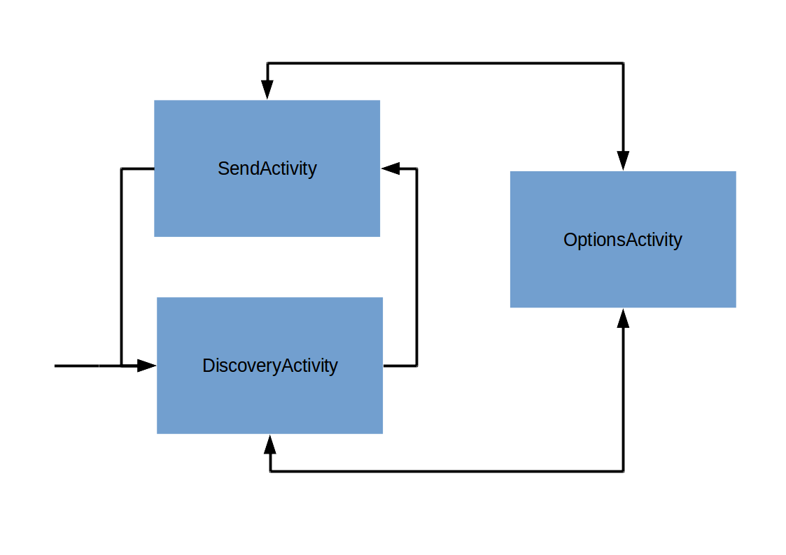
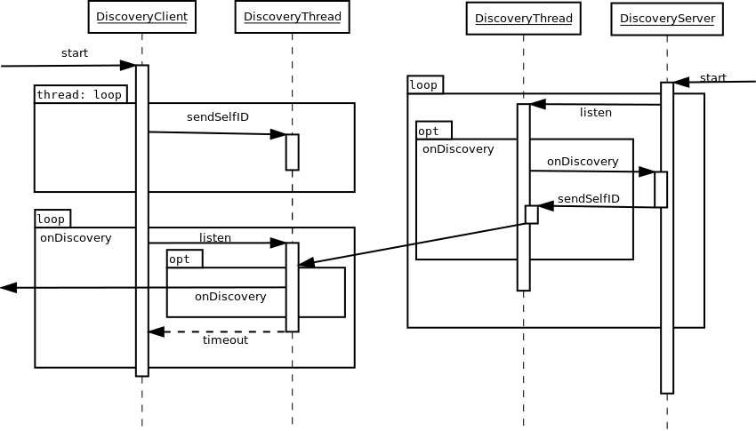
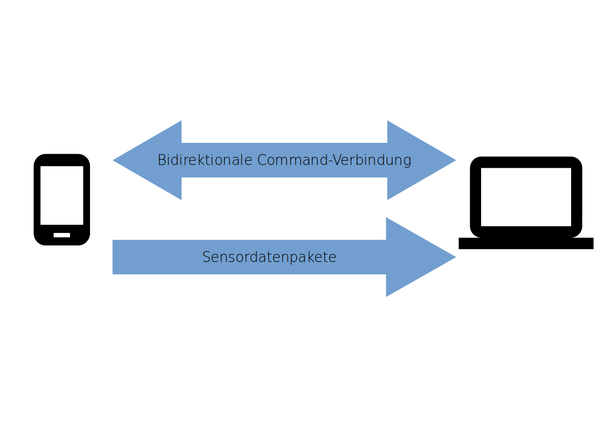

# Architektur
Das Psychic-Framework ist dreigeteilt in die App, den Server und einen gemeinsamen Kern.

## Gemeinsamer Kern
Im gemeinsamen Kern (dem ```common```-Package) sind alle Klassen enthalten, die sowohl vom Server als auch von der App benötigt werden.

## App
Die App ist dafür zuständig, den Nutzer Server finden zu lassen und mit Servern zu kommunizieren. Sie erlaubt es dem Nutzer außerdem, die Sensitivität für alle Sensoren zu ändern und den Gerätenamen festzulegen.
Wenn der Nutzer sich dafür entschieden hat, mit einem Server in Verbindung zu treten, wird die App anfangen, die Daten der angefragten Sensoren zu übermitteln. Außerdem stellt sie die vom Implementator angefragten Buttons dar, und Benachrichtigt den Server über Knopfdrücke.on



## Server
Der Server-Teil des Psychic-Frameworks dient dazu, die Erstellung von neuen Servern möglichst einfach zu machen. Beispiele lassen befinden sich im ```examples```-Package.

# Server-Discovery

Grundlage der Serverfindung auf PC und Handy ist der sogenannte  ```DiscoveryThread```, in dem sich Funktionen befinden, die von Server und Client benötigen. Wichtig sind für die Funktionsweise insbesondere ```sendSelfID```, ```listen``` und der ```onDiscovery```-Callback.

```sendSelfID``` sendet die für weitere Kommunikation notwendigen Informationen in Form eines sich selbst beschreibenden ```NetworkDevice```. Der Client verwendet diese Funktion, um Server via Broadcast zu finden: Empfängt der Server ein solches Paket, wird ```onDiscovery``` aufgerufen, und der ```DiscoveryServer``` schickt an den Sender des Paketes seine eigene Identifikation via ```sendSelfID```. Dann ist der Server dem ```DiscoveryClient``` bekannt, und der ```onDiscovery```-Callback wird aufgerufen. Die App zeigt dem Nutzer den Server dann an, so dass dieser dem Client eine Verbindungsanfrage stellen kann. Erlaubt die Implementation dem Client die Verbindung, ist die Verbindung aufgebaut.

```listen``` ist auf Client und Server dafür zuständig, per ```sendSelfID``` gesendete Pakete zu empfangen, und den ```onDiscovery```-Callback auszulösen.
Der Port, auf dem der Server die Broadcasts erwartet, muss in der App eingegeben werden, falls nicht der Standardport ```8888``` verwendet wird.

# Kommunikation
Alle Daten und Commands werden als serialisierte Java-Objekte übertragen. Das Framework nutzt für alle Ports zufällige freie Ports, ausgenommen den für die Serverfindung genutzten, da dieser der App im Voraus bekannt sein muss.


## Kontrollverbindung
Die Kontrollverbindung läuft über TCP; für jede neue Kontrollnachricht wird eine neue Verbindung aufgebaut. Jede der Kontrollnachrichten ist ein ```AbstractCommand```. Diese Klasse enthält ein Enum, dass den Typ des Kontrollpakets beschreibt, so dass es einfach in die entsprechende Klasse gecastet werden kann. Diese Klassen können Instanzen aller serialisierbaren Klassen enthalten, so dass alle benötigten Daten einfach mitgeliefert werden können.

Die Kontrollverbindung ist bidirektional, der Client kann also auch ```AbstractCommand```-Objekte an den Server schicken. Das wird unter anderem für die Knöpfe verwendet, aber auch um den Server über den Wertebereich von Sensoren zu informieren.

## Datenverbindung
Nachdem der Nutzer sich mit einem Server verbunden hat, übermittelt dieser die aktuell benötigte Konfiguration. Nachdem die App diese umgesetzt hat, sind die benötigten Sensoren aktiviert. Alle generierten Daten werden ohne weitere Verarbeitung serialisiert und an den Datenport des Servers übermittelt, um den Rechenaufwand in der App möglichst gering zu halten. Die Übermittlung läuft über UDP, so dass kein expliziter Verbindungsaufbau für jedes Paket nötig ist.