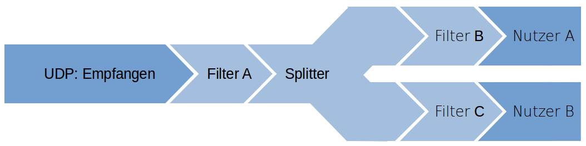

# Developer Guide

## Working Title: psychic giggle
Psychic Giggle ist ein Framework zur Nutzung von Android-Sensoren auf PCs zur einfachen und schnellen Verwendung von Sensordaten auf dem Computer.

# Grundlegende Verwendung:
Zur Erstellung minimaler Funktionalität wird folgender Code benötigt:

```Java
public class ExampleServer implements NetworkDataSink {
	public ExampleServer() throws IOException {
		Server server = new Server();
		server.registerDataSink(this, SensorType.LinearAcceleration);
		server.start();
	}

	public void onData(NetworkDevice origin, SensorData sensorData, float userSensitivity){
	}

	public void close(){
	}
}
```

Im Konstruktor wurde ein Server erstellt und ```this``` wurde als NetworkDataSink für den LinearAcceleration-Sensor registriert.
Nachdem der Server mit ```start()``` gestartet wurde, können die ankommenden Daten in ```onData``` verarbeitet werden. Hierzu muss auf ```sensorData.data``` zugegriffen werden, ein ```float[]```, das die Sensordaten enthält.
In der ```close()``` sollten alle verwendeten Ressourcen freigegeben werden.

## ```NetworkDevice```
Das ```NetworkDevice``` wird vielfach verwendet um Clients und Server zu identifizieren. Mit ```getInetAddress()``` kann die aktuelle IP-Adresse als ```InetAddress``` abgefragt werden, unter ```getName()``` ist der Name des ```NetworkDevice``` verfügbar. Wenn ```NetworkDevice.equals(NetworkDevice)``` ```true``` zurückgibt, dann handelt es sich um einen Client an der selben Adresse.

## Sensoren
Die unterstützten Sensoren sind:
* Accelerometer
* AmbientTemperature
* GameRotationVector
* Gravity
* Gyroscope
* GyroscopeUncalibrated
* Light
* LinearAcceleration
* MagneticField
* MagneticFieldUncalibrated
* Orientation
* Pressure
* Proximity
* RelativeHumidity
* RotationVector

Diese Liste ist synonym mit dem ```SensorType```-Enum. Enthalten sind alle Sensoren, deren [reporting mode](https://source.android.com/devices/sensors/report-modes.html) ```continuous``` oder ```on-change``` ist und die bis spätestens API-Level 19 unterstützt wurden. 

### Maximalwerte
Die Maximalwerte der Sensoren können mithilfe von ```getSensorMaximumRange(SensorType)``` für alle verbundenen Geräte oder mit ```getSensorMaximumRange(SensorType, NetworkDevice)``` für ein spezielles Gerät abgefragt werden.

Siehe auch die [Android-Dokumentation](https://developer.android.com/reference/android/hardware/Sensor.html#getMaximumRange()) zum Thema.

### Update-Frequenz
Die Update-Frequenz der Android-Sensoren kann mithilfe von ```setSensorSpeed()``` gesetzt werden, unterstützt sind die folgenden Werte:
* [SENSOR_DELAY_FASTEST](https://developer.android.com/reference/android/hardware/SensorManager.html#SENSOR_DELAY_FASTEST)
* [SENSOR_DELAY_GAME](https://developer.android.com/reference/android/hardware/SensorManager.html#SENSOR_DELAY_GAME)
* [SENSOR_DELAY_NORMAL](https://developer.android.com/reference/android/hardware/SensorManager.html#SENSOR_DELAY_NORMAL)
* [SENSOR_DELAY_UI](https://developer.android.com/reference/android/hardware/SensorManager.html#SENSOR_DELAY_UI)

## Verwendung von Buttons
```Java
public class ExampleServer implements ButtonListener {
	public ExampleServer() throws IOException {
		Server server = new Server();
		server.start();

		server.setButtonListener(this);
		server.addButton("Erster Button", 0);
		server.addButton("Zweiter Button", 1);
		//server.setButtonLayout(xmlFileContent);
	}

	public void onButtonClick(ButtonClick buttonClick , NetworkDevice origin){
	}
}

```

Im Konstruktor muss ein ButtonListener gesetzt werden. Daraufhin können Buttons mit ```addButton(String, int)``` hinzugefügt werden. Der ```String``` ist der Text den der Button anzeigt, der ```int``` ist die ID, die beim Drücken des Buttons an den Server gesendet wird. Buttons werden auf allen verbundenen Clients angezeigt. Buttoninputs können dann in der ```onButtonClick``` verarbeitet werden. Mithilfe von ```buttonClick.getId()``` kann der Button identifiziert werden, und ```buttonClick.isPressed()``` ist ```true``` wenn der Button gedrückt wurde.

Zum Entfernen einzelner Buttons kann ```removeButtons(int)``` verwendet werden

### Layouts laden
Eine Alternative ist die Verwendung von ```setButtonLayout(String)```. Hierbei kann eine eigene Android XML Layout Datei als ```String``` übergeben werden.  Bei Verwendung von ```setButtonLayout(String)``` werden alle durch ```addButton(String, int)``` hinzugefügten Buttons entfernt und bei Verwendung von ```addButton(String, int)``` wird das durch ```setButtonLayout``` erstellte Layout entfernt.

#### Einschränkungen für die Layout-Dateien
Es werden nur ```LinearLayout```- und ```Button```-Objekte unterstützt. Ein Beispiel für einen unterstützten XML-String ist das folgende Snippet:
```xml
<?xml version="1.0" encoding="utf-8"?>
<LinearLayout xmlns:android="http://schemas.android.com/apk/res/android"
    android:orientation="vertical" android:layout_width="match_parent"
    android:layout_height="match_parent">

    <Button
        android:text="A"
        android:layout_width="match_parent"
        android:layout_height="wrap_content"
        android:id="0"
        android:layout_weight="5"/>
</LinearLayout>
```
Für ```Button``` werden die folgenden Attribute unterstützt:
* ```android:text=""``` enthält den vom Button dargestellten Text
* ```android:id=""``` ist die ID die an den Server übertragen wird, und dort mithilfe von ```ButtonClick.getId()``` abgefragt werden kann
* ```android:layout_weight=""``` wird direkt für den Button gesetzt. Genaue Informationen sind in der [Android-Dokumentation](https://developer.android.com/guide/topics/ui/layout/linear.html#Weight) zu finden.

Für ```LinearLayout``` werden die folgenden Attribute unterstützt:
* ```android:layout_weight=""``` wird direkt für das Layout gesetzt. Genaue Informationen sind in der [Android-Dokumentation](https://developer.android.com/guide/topics/ui/layout/linear.html#Weight) zu finden.
* ```android:orientation=""``` wird direkt für das Layout gesetzt. Genaue Informationen sind in der [Android-Dokumentation](https://developer.android.com/reference/android/widget/LinearLayout.html#attr_android:orientation) zu finden.

Bei Verwendung von ```setButtonLayout(String)``` werden alle durch ```addButton(String, int)``` hinzugefügten Buttons entfernt und bei
Verwendung von ```addButton(String, int)``` wird das durch ```setButtonLayout``` erstellte Layout entfernt.

Um alle Buttons zu entfernen kann ```clearButtons()``` aufgerufen werden.

## Verwaltung von Clients
```Java
public class ExampleServer implements ClientListener {
	public ExampleServer() throws IOException {
		Server server = new Server();
		server.start();

		server.setClientListener(this);
	}

    public boolean acceptClient(NetworkDevice newClient) {
        return false;
    }

    public void onClientDisconnected(NetworkDevice disconnectedClient) {
    }

    public void onClientTimeout(NetworkDevice timeoutClient) {
    }

    public void onClientAccepted(NetworkDevice connectedClient) {
    }
```
Um die verschiedenen Client events zu handeln, muss ein ```ClientListener``` gesetzt werden, der die Events empfängt.

### Maximale Anzahl Clients
Die maximale Anzahl von Clients ist theoretisch nicht beschränkt. Ein nutzerdefiniertes Maximum kann mithilfe von ```setClientMaximum(int)``` gesetzt werden, mit ```getClientMaximum()``` abgefragt werden und mit ```removeClientMaximum()``` entfernt werden.

## ```acceptClient(NetworkDevice)```
wird immer dann aufgerufen, wenn ein neuer Client versucht sich mit dem Server zu verbinden. Die
Addresse des Clients und sein Name sind mit ```newClient.getInetAddress()``` und ```newClient.name``` verfügbar.
Wenn ```acceptClient(NetworkDevice)``` ```true``` zurückgibt, wird der Client angenommen; gibt es ```false``` zurück, wird der Client
abgelehnt.

## ```onClientDisconnected(NetworkDevice)```
wird aufgerufen, wenn ein Client die Verbindung beendet hat oder nicht mehr erreichbar ist.
Der Client ist zum Zeitpunkt des Aufrufs nicht mehr über den Server verfügbar.

## ```onClientTimeout(NetworkDevice)```
wird aufgerufen, wenn ein Client eine zeitlang nicht mehr reagiert. Der Client ist zum Zeitpunkt
des Aufrufs nicht mehr über den Server verfügbar.

## ```onClientAccepted(NetworkDevice)```
wird aufgerufen wenn  die Kommunikation zwischen Server und dem neuen Client funktioniert. Diese Funktion wird nur dann aufgerufen, wenn ```acceptClient(NetworkDevice)``` ```true``` für das entsprechende ```NetworkDevice``` zurückgegeben hat.

## Exceptionhandling
```Java
public class ExampleServer implements ExceptionListener {
    public ExampleServer() throws IOException {
        Server server = new Server();
        server.start();

        server.setExceptionListener(this);
    }

    public void onException(Object origin, Exception exception, String info) {
    }
}
```
Um alle Exceptions die in verschiedenen Threads auftreten aufzufangen muss ein ```ExceptionListener``` registriert werden. ```onException(Object, Exception, String)``` wird dann aufgerufen, falls eine Exception auftritt, die nicht intern behandelt werden kann. Der ```origin```-Parameter gibt das Ursprungsobjekt (oder ein übergeordnetes, falls das Ursprungsobjekt dem Nutzer nicht bekannt ist) an, der ```exception```-Parameter gibt die Exception on, und der ```info```-Parameter enthält weitere Informationen zu der Exception und ihrem Grund.

## Resetevents
```Java
public class ExampleServer implements ResetListener {
    public ExampleServer() throws IOException {
        Server server = new Server();
        server.start();

        server.setResetListener(this);
    }

    public void onResetPosition(NetworkDevice origin) {
    }
}
```
Wenn ein Client den "Reset"-Button auf seinem Handy benutzt, wird die ```onResetPosition(NetworkDevice)``` aufgerufen. Dann sollte der derzeitige Status des Handys zurückgesetzt werden, bei der Beispielimplementation ```MouseServer``` wird der Mauszeiger in die Mitte des Bildschirms gesetzt.

## Entfernen einer ```NetworkDataSink```
Wenn eine ```NetworkDataSink``` nicht mehr benötigt wird, zum Beispiel weil der entsprechende Client getrennt wurde, kann sie mit ```unregisterDataSink(NetworkDataSink)``` von allen Sensoren abgemeldet werden, und mit  ```unregisterDataSink(NetworkDataSink, SensorType)``` von bestimmten Sensoren abgemeldet werden. Danach erhält die ```NetworkDataSink``` keine Daten mehr vom Server.

# Daten-Pipeline

Psychic-Giggle ist darauf ausgerichtet, dass die Sensordaten mithilfe einer Pipeline benutzt werden. Diese Pipeline beginnt auf dem Handy mit dem Sensor, und endet in einer ```NetworkDataSink``` auf dem Server, die die Daten verwendet. Bis dahin können die SensorDaten durch Klassen, die ```NetworkDataSink``` und ```NetworkDataSource``` implementieren, verändert werden.

## Daten-Filter
Datenfilter sind Unterklassen von ```AbstractFilter``` oder Klassen die ```NetworkDataSink``` und ```NetworkDataSource``` implementieren. In diesen Klassen können die Daten verändert werden, zum Beispiel um einen Tiefpassfilter umzusetzen. 

### Beispiel
```Java
class MyFilter extends AbstractFilter {
    MyFilter(NetworkDataSink sink){
        super(sink);
    }

    public void onData(NetworkDevice origin, SensorData sensorData, float userSensitivity) {
        modifyData(sensorData.data);
        mDataSink.onData(origin, sensorData, userSensitivity);
    }
}
```
In der ```onData``` kommen die Daten aus dem vorherigen Pipeline-Element an. Nach dem verändern (z.B. duch eine ```modifyData```-Funktion) müssen die Daten mithilfe von ```mDataSink``` an das nächste Element weitergeleitet werden. Damit ```mDataSink``` belegt ist, muss entweder ```AbstractFilter(NetworkDataSink)``` benutzt werden, oder es muss auf ```null``` gecheckt werden, um abzuwarten bis ```setDataSink(NetworkDataSink)``` aufgerufen wurde.

### Vorhandene ```AbstractFilter```-Implementationen
* ```AbsoluteFilter```: Ersetzt alle Werte durch den Absolutwert
* ```AveragingFilter```: Ersetzt die Werte durch den Durchschnitt der letzten n Werte
* ```DifferenceThresholdFilter```: Ersetzt die Werte durch ```0```, wenn die Differenz zwischen aufeinanderfolgenden Werten nicht groß genug ist
* ```IntegratingFilter```: Ersetzt die Werte durch die Summe der vorherigen Werte
* ```MinimumAmplitudeChangeFilter```: Ersetzt den Wert durch den vorherigen Wert wenn die Differenz zwischen aufeinanderfolgenden Werten nicht groß genug ist
* ```ScalingFilter```: Skaliert die Werte von ```0-sourceRange``` zu ```-target-targetRange```
* ```TemporaryIntegratingFilter```: Bildet die Summe der letzten ```n``` Werte.
* ```ThresholdingFilter```: Ersetzt die Werte durch ```0``` wenn die Amplitude nicht groß genug ist
* ```UserSensitivityMultiplicator```: Multipliziert die Daten mit dem ```userSensitivity```-Faktor und ersetzt diesen durch 1. 

## Daten-Splitter
Daten-Splitter sind Klassen, die ```NetworkDataSink``` implementieren, und die erhaltenen Daten an verschiedene ```NetworkDataSink```s weiterleiten. 
Vorhandenen Implementierungen:
* ```ClientSensorSplitter```: Nur Daten, für deren Client und Sensor eine ```NetworkDataSink``` registriert wurde, werden an diese weitergeleitet
* ```ClientSplitter```: Nur Daten, für deren Client eine ```NetworkDataSink``` registriert wurde, werden an diese weitergeleitet
* ```SensorSplitter```: Nur Daten, für deren Sensor eine ```NetworkDataSink``` registriert wurde, werden an diese weitergeleitet.
* ```PipelineDuplication```: Alle Daten werden dupliziert und an alle registrierten ```NetworkDataSink```s weitergeleitet.
* ```Switch```: Die Daten werden an eine von zwei ```NetworkDataSink```s weitergeleitet 

## Pipeline-Builder
Mit einer ```FilterPipelineBuilder```-Instanz lassen sich Filterpipelines einfach erstellen. 

### Elemente hinzufügen
Es gibt drei Methoden um ein neues Element in die Pipeline einzubauen: ```prepend(AbstractFilter)```, um ein Element an den Anfang zu setzen; ```append(AbstractFilter)```, um ein Element ans Ende der Pipeline zu setzen, und ```append(AbstractFilter, int)``` um ein Filterelement in eine beliebige Position der Pipeline zu setzen. 

### Elemente entfernen
Pipelineelemente können mit ```remove(int)``` oder ```remove(AbstractFilter)``` wieder entfernt werden.

### Pipeline abschließen
Die Pipeline kann mit ```build()``` abgeschlossen werden; dann ist der letzte ```AbstractFilter``` der ans Ende platziert wurde das letze Element in der Pipeline, und die Funktion gibt den Anfang der Pipeline zurück. Mithilfe von ```build(NetworkDataSink)``` kann das letzte Element auch nur eine DatenSenke sein, nützlich zum Beispiel wenn das letzte Pipelineelement die Daten nicht weiterleiten muss.

# Netzwerkverbindung
## Server-Discovery
Das Psychic-Framework nutzt UDP-Broadcasts der Clients bzw. der App, auf die der Server mit seiner Adresse antwortet. Der Port, auf dem der Server die Broadcasts erwartet, muss in der App eingegeben werden, falls nicht der Standardport ```8888``` verwendet wird.

## Datenverbindung
Der Server wartet für jeden Client auf einem eigenen Port auf Daten, die via UDP gesendet werden. Dieser Port wird vom Server gewählt und in der Discovery-Phase dem Client mitgeteilt; es ist ein zufälliger freier Port. 

## Kontrollverbindung
Der Server und die App warten jeweils auf zufällig gewählten freien Port; diese werden in der Discovery-Phase ausgetauscht. Die Kontrollverbindung läuft über TCP; für jede neue Kontrollnachricht (```AbstractCommand```) wird eine neue Verbindung aufgebaut.

# License
Copyright (c) 2017 by the contributors. All rights reserved.
