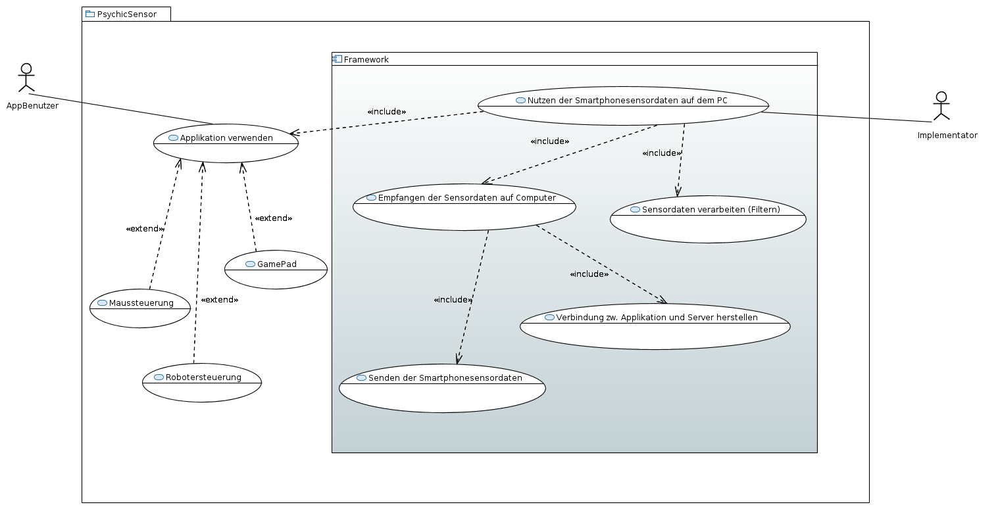
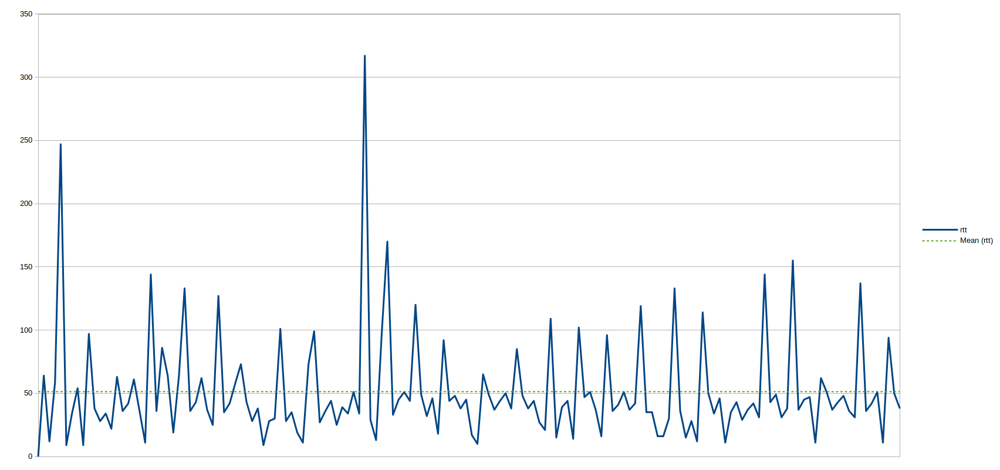

# Ziel
Das Ziel des Projekts war die Erstellung eines Frameworks zur Nutzung von Sensordaten von Androidgeräten auf javafähigen Endgeräten und die Demonstration der Funktionalität dieses Frameworks anhand von drei Beispielanwendungen.
Mit dem von uns erstellten Framework soll Drittpersonen die Umsetzung von Projekten mit Sensordaten erheblich erleichtert werden.

# UseCase-Analyse

Der AppBenutzer verwendet die App und einen vom Implementator vorgefertigten Server um Sensordaten auf eine bestimmte Art zu verwenden.

Der Implementator nutzt das Framework um einen Server mit gewünschter Funktionalität umzusetzen,
der dann von AppBenutzern verwendet werden kann.
Hierzu muss das Senden und Empfangen der Sensordaten über eine Verbindung zwischen App und Server, sowie das Verarbeiten dieser Daten berücksichtig werden.

Zur Demonstration dienen eine Maussteuerung, eine Robotersteuerung und ein GamePad zur Spielsteuerung.

# Requirements
Die zur Demonstration dienenden Anwendungen stellen schwer zu definierende Anforderungen an die Latenz und Frequenz der Sensordaten. Wir haben versucht, uns beim Festlegen der Grenzwerte auf bekannte Geräte zu beziehen, die keine Probleme bei der Bedienbarkeit haben.

## Frequenz
Für die Frequenz der Sensordaten haben wir uns an der Playstation 3 von Sony orientiert: Diese stellt die laufenden Spiele mit 24 Bildern pro Sekunde dar, ein Wert mit dem die meisten Menschen problemlos auch schnelle Actionspiele bedienen können. Daraus entstand für uns die Anforderung, mindestens 30 Updates der Sensordaten pro Sekunde unterstützen zu können.

## Latenz
Eine akzeptable Grenze für die Latenz festzulegen war ebenfalls schwierig, da Latenzen im Millisekundenbereich nur schwerlich per Hand festzulegen sind. Wir haben daher versucht, uns über die Latenzen professionell hergestellter kabelloser Eingabegeräte zu informieren. Leider ist auch das schwierig, da Hersteller dazu meist keine Informationen veröffentlichen. Wir haben jedoch diesen Artikel von [www.eurogramer.net](http://www.eurogamer.net/articles/digitalfoundry-lag-factor-article?page=2) gefunden, die sich mit Input-Lag von Konsolen beschäftigt, und bei unterschiedlichen Spielen Unterschiede über 50ms gefunden. Da beide Spiele bedienbar sind, sollte eine Latenz unter diesem Wert keine Probleme verursachen.

## Jitter?

## Analyse des Ergebnisses

TODO jittergraph

Für die Maussteuerung hatten wir uns folgende Requirements gesetzt: Die Steuerung sollte sehr direkt sein, damit sie die Hauptaufgaben einer Maus übernehmen kann. Das sind Rechts- und Linksklick, damit verbunden der Doppelklick und das Markieren und Bewegen von Dateien, sowie das Bedienen des Kontextmenüs.
Für die Spielsteuerung haben wir einen SNES-Controller imitiert, mit dem wir das Spiel „Super Mario Kart“ spielen können. Unser Ziel war es auf der 1. Strecke mit der Gesamtzeit eines nativen Controller konkurrieren zu können. Nach einigen Tests ergab sich daraus eine Zeit von 1:20. Für den Mehrspielermodus brauchten wir dann eine Multiclientunterstützung. Um mehr Sensoren zu verwenden haben wir beschlossen die Item Mechanik durch einen weiteren Sensor zu steuern.
Die Robotersteuerung ist eine Umsetzung des Kuka Roboters „KUKA LBR Iiwa 7 R800“, der ein Murmellabyrinth bedienen soll. Dazu wird er in eine bestimme Position gebracht, und es lässt sich nur das letzte Neigungs-Rotationspaar des Roboterarms bewegen. Dadurch ist es möglich das Labyrinth durch geschickte Neigungen zu lösen.
Unser oberstes Ziel war es, die App und den Server sehr benutzerfreundlich zu gestalten. Die App sollte sehr leicht bedienbar sein, sodass sehr wenige Konfigurationen notwendig sind. Den App-Code selber muss man dafür nicht verändern, neue Funktionen sind am Server schnell hinzufügbar. So kann man z.B. das Layout für die Buttons, die vom Server gesetzt werden, durch eine XML-Datei anpassen. Für eine angenehme und genaue Steuerung sollte man durch einfache Datenfilter im Server die Sensibilität selber einstellen können. Die Server sollten natürlich auch leicht zu finden, und auch zu wechseln sein. Zur Benutzerfreundlichkeit gehört auch, dass die App Cross-Plattform einsetzbar ist. Unser Server ist auf allen Geräten mit JDK 8 und Zugang zu WLAN-Netzwerken zu nutzen, die App auf allen Android Geräten (Android 4.4 oder höher). Zum Verbinden muss man lediglich den Discovery Port einstellen, für die restlichen Verbindungen werden freie Ports automatisch gesucht.

# Lessons learned
Es ist deutlich effektiver sich gemeinsam zu festen Zeiten zu treffen um zusammen zu arbeiten als allein. Dadurch haben wir direktes Feedback zu neuen Ideen und deren Umsetzungen von den anderen Teammitgliedern bekommen. Pairprogramming erlaubt Diskussionen und konstruktive Lösungen von neuen Problemen durch andere zu erhalten.
Uns fiel es schwer Grenzwerte für messbare Requirements zu erstellen, die das Projekt beschreiben.
Ein frühzeitiges Festlegen des deployment formats verhindert die Benutzung von Softwarearchitekturen, die eine spätere Bereitstellung der Software erschweren.
