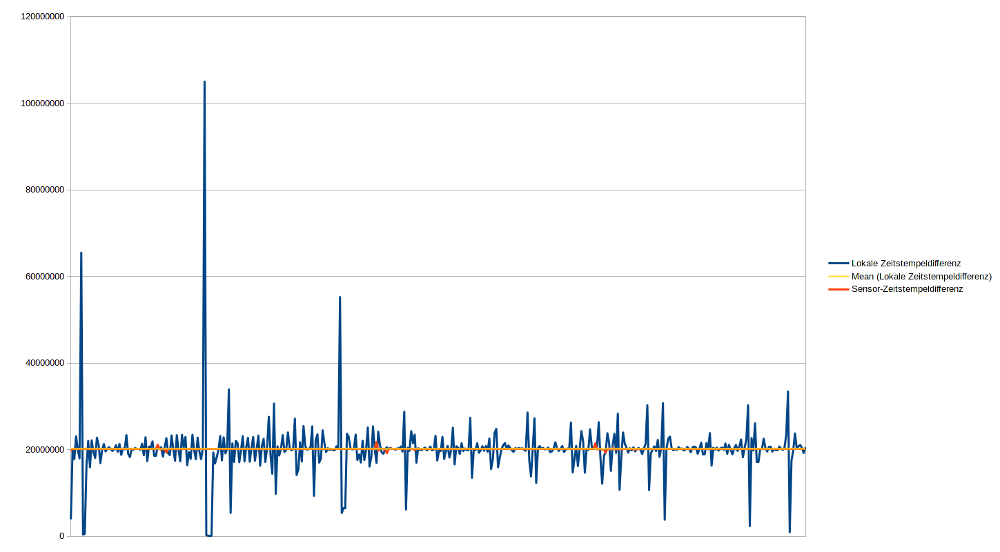

# Ziel
Das Ziel des Projekts war die Erstellung eines Frameworks zur Nutzung von Sensordaten von Androidgeräten auf javafähigen Endgeräten und die Demonstration der Funktionalität dieses Frameworks anhand von drei Beispielanwendungen, nämlich einer Maussteuerung, einer Spielsteuerung und die Bedienung eines Murmellabyrinthes mithilfe eines Roboters.
Mit dem von uns erstellten Framework soll Drittpersonen die Umsetzung von Projekten mit Sensordaten erheblich erleichtert werden.

# UseCase-Analyse

Der AppBenutzer verwendet die App und einen vom Implementator vorgefertigten Server um Sensordaten auf eine bestimmte Art zu verwenden.

Der Implementator nutzt das Framework um einen Server mit gewünschter Funktionalität umzusetzen,
der dann von AppBenutzern verwendet werden kann.
Hierzu muss das Senden und Empfangen der Sensordaten über eine Verbindung zwischen App und Server, sowie das Verarbeiten dieser Daten berücksichtig werden.

Zur Demonstration dienen eine Maussteuerung, eine Robotersteuerung und ein GamePad zur Spielsteuerung.

# Requirements
Die zur Demonstration dienenden Anwendungen stellen schwer zu definierende Anforderungen an die Latenz und Frequenz der Sensordaten. Wir haben versucht, uns beim Festlegen der Grenzwerte auf bekannte Geräte zu beziehen, die keine Probleme bei der Bedienbarkeit haben. 

## Frequenz
Für die Frequenz der Sensordaten haben wir uns an der Playstation 3 von Sony orientiert: Diese stellt die laufenden Spiele mit 24 Bildern pro Sekunde dar, ein Wert mit dem die meisten Menschen problemlos auch schnelle Actionspiele bedienen können. Daraus entstand für uns die Anforderung, mindestens 30 Updates der Sensordaten pro Sekunde unterstützen zu können.

## Latenz
Eine akzeptable Grenze für die Latenz festzulegen war ebenfalls schwierig, da Latenzen im Millisekundenbereich nur schwerlich per Hand festzulegen sind. Wir haben daher versucht, uns über die Latenzen professionell hergestellter kabelloser Eingabegeräte zu informieren. Leider ist auch das schwierig, da Hersteller dazu meist keine Informationen veröffentlichen. Wir haben jedoch diesen Artikel von [www.eurogamer.net](http://www.eurogamer.net/articles/digitalfoundry-lag-factor-article?page=2) gefunden, die sich mit Input-Lag von Konsolen beschäftigt, und bei unterschiedlichen Spielen Unterschiede über 50ms gefunden. Da beide Spiele bedienbar sind, sollte eine Latenz unter diesem Wert keine Probleme verursachen.

## Jitter?

## Maussteuerung
Zusätzlich zu den Anforderungen an die Netzwerkparameter, die flüssige und direkte Steuerung garantieren sollen, muss die Maus auch Knöpfe zur Verfügung stellen, um eine normale Maus zu emulieren.

## Spielsteuerung
Für die Spielsteuerung haben wir einen SNES-Controller emuliert, mit dem wir das Spiel „Super Mario Kart“ spielen können. Wir haben uns für dieses Spiel entschieden, weil für die meisten Spiele sehr viele Knöpfe benötigt werden, die auf einem Touchscreen ohne haptisches Feedback schwer zu bedienen sind während man auf das Spiel schaut.
Um die Anforderungen an die Spielbarkeit festzulegen, haben wir die Zeiten einiger Läufe mit nativen Controllern auf der ersten Karte des Spiels, "Mario Circuit 1", gemessen. Dadurch hatten wir einen Vergleichswert von 1:20, die wir mit unserem Controller mindestens erreichen wollten, bei der dieser einem nativen Controller ähnlich ist.

Die Item-Mechanik von "Super Mario Kart" bietet die Verwendung eines zweiten Sensors an, um Gegenstände zu werfen, weshalb wir die gleichzeitige Nutzung mehrerer Sensoren unterstützen wollten. 

Außerdem besitzt das Spiel einen Mehrspielermodus, den wir ebenfalls unterstützen wollten, weshalb wir mehrere Clients zur gleichen Zeit annehmen können mussten.

## Robotersteuerung
Die Robotersteuerung stellt keine Anforderungen, die nicht bereits durch die Maussteuerung und der Spielsteuerung gestellt wurden, da die Anforderungen an Latenz und Frequenz nicht höher sind, und Buttons auch schon von der Maus- und Spielsteuerung benötigt werden.

## Framework
Da wir ein Framework erstellen wollten, mussten wir darauf achten dass unser Projekt nicht nur für unsere Beispiele nutzbar ist. Deshalb werden möglichst viele der unter Android verfügbaren Sensoren unterstützt.

## Bedienbarkeit
Die App sollte möglichst benutzerfreundlich erstellt sein.

Die App und der Server sehr benutzerfreundlich zu gestalten. Die App sollte sehr leicht bedienbar sein, sodass sehr wenige Konfigurationen notwendig sind. 

Den App-Code selber muss man dafür nicht verändern, neue Funktionen sind am Server schnell hinzufügbar. 
So kann man z.B. das Layout für die Buttons, die vom Server gesetzt werden, durch eine XML-Datei anpassen. 
Für eine angenehme und genaue Steuerung sollte man durch einfache Datenfilter im Server die Sensibilität selber einstellen können. 
Die Server sollten natürlich auch leicht zu finden, und auch zu wechseln sein. 
Zur Benutzerfreundlichkeit gehört auch, dass die App Cross-Plattform einsetzbar ist. 
Unser Server ist auf allen Geräten mit JDK 8 und Zugang zu WLAN-Netzwerken zu nutzen, die App auf allen Android Geräten (Android 4.4 oder höher). 
Zum Verbinden muss man lediglich den Discovery Port einstellen, für die restlichen Verbindungen werden freie Ports automatisch gesucht. 

# Analyse des Ergebnisses
## Latenz

Die y-Achse ist in Millisekunden angegeben. Da sich die Timestamps des Handys und des Servers nie exakt synchronisieren lassen, haben wir die Round-Trip-Time gemessen. Wie zu sehen ist, liegt die durchschnittliche Round-Trip-Time bei 50ms; die Latenz zwischen Generierung der Sensordaten wird dementsprechend ungefähr bei 25 Millisekunden liegen. Wir sehen unsere Anforderung an die Latenz damit erfüllt.

## Frequenz

Die y-Achse ist in Millisekunden angegeben. Da sich die Timestamps des Handys und des Servers nie exakt synchronisieren lassen, lässt sich hier nur die Differenz zwischen den Ankunftszeiten auf dem PC, und den Sensor-Event-Timestamps auf dem Handy berechnen. Wie zu sehen ist, ist der Durchschnitt der Abstände zwischen dem Ankommen von Sensordaten ungefähr 20ms, was in einer Frequenz von 50Hz resultiert. Da 50Hz unsere Anforderung von 30Hz deutlich überschreitet, sehen wir auch dieses Requirement als erfüllt an. 

## Anforderungen der drei Steuerungen
Unsere Anforderungen an die Frequenz haben die Mindestanforderungen der drei Beispielimplementationen zumindest erreicht, da die Steuerungen keine Probleme mit schlechten Reaktionszeiten zeigen.

# Lessons learned
Es ist deutlich effektiver sich gemeinsam zu festen Zeiten zu treffen um zusammen zu arbeiten als allein. Dadurch haben wir direktes Feedback zu neuen Ideen und deren Umsetzungen von den anderen Teammitgliedern bekommen. Pairprogramming erlaubt Diskussionen und konstruktive Lösungen von neuen Problemen durch andere zu erhalten.
Uns fiel es schwer Grenzwerte für messbare Requirements zu erstellen, die das Projekt beschreiben.
Ein frühzeitiges Festlegen des deployment formats verhindert die Benutzung von Softwarearchitekturen, die eine spätere Bereitstellung der Software erschweren.
